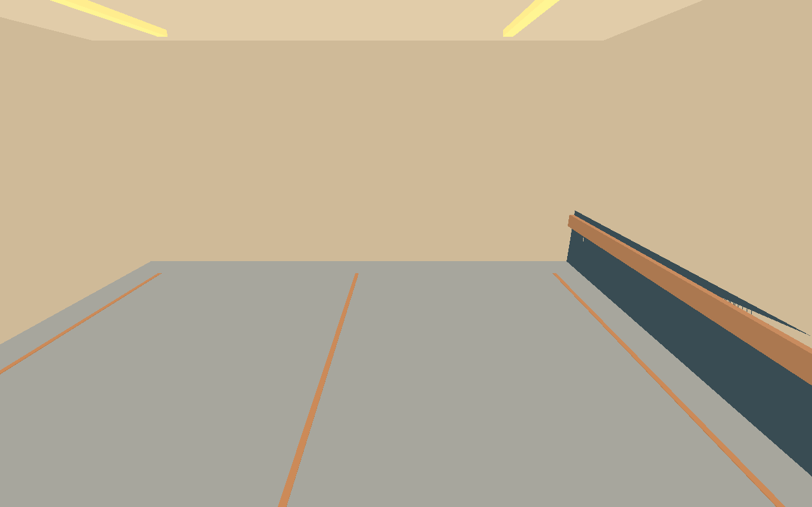
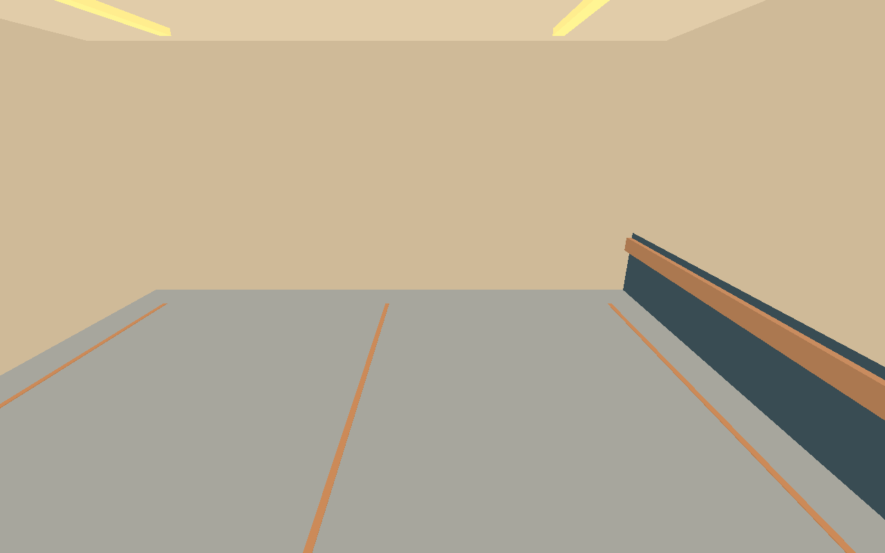
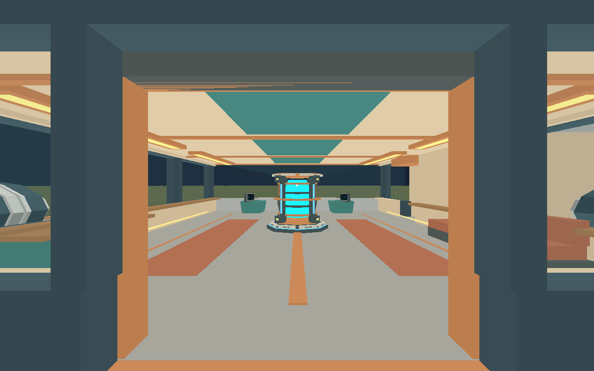
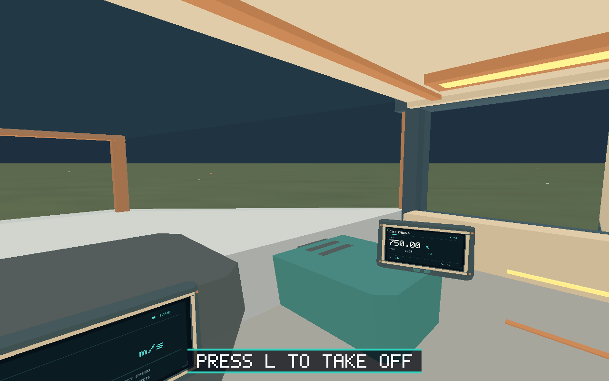

# Issue #34 validation

The scout now has a dedicated port cargo room with a 29.7 m² clear floor and
1.8 m level passage. The exterior is 20.90 × 4.00 × 21.00 m. Cockpit and aft
airlock anchors are preserved; the port engine shifts 0.60 m aft to clear the
new room. All exterior vertices fit the 16 m flight sphere. The familiar 15 m
local takeoff/touchdown stage remains unchanged.

Validation on 2026-10-01:

- Asset validator: 5,720 triangles, 119 primitives, 13 materials, 497,628-byte GLB;
  source/exports/proxies/generated Rust bounds match. All budgets pass.
- `cargo build --workspace --locked`, `cargo fmt --all -- --check`,
  `cargo clippy --workspace --all-targets --locked -- -D warnings`: pass.
- `cargo test --workspace --locked`: 210 tests pass, including cargo wall,
  passage traversal and level-floor return coverage.
- Python runner/build contracts: 29 tests pass.
- The seven-scenario native suite passes three consecutive runs (21 scenarios).
  Existing landing, door collision, transitions, mining and carrying routes pass.
- Final cargo visual scenario: all 140 steps pass, including five screenshot
  checkpoints. Real input exercises exterior exit, closed-door rejection,
  re-entry, cargo passage/walls/partition, return to the airlock/cockpit,
  assisted takeoff and traversal of the room in flight.

[validation.json](validation.json) contains compact assertion results, checkpoint
player/ship state and the three suite summaries. The final visual run and another complete native suite pass follow
a small additional asset-only seam cleanup. The normal harness emits full
per-step state, protocol/process logs and screenshots under `artifacts/e2e/`;
these generated directories are not checked in. Linux CI runs the baseline
cargo scenario and its visual variant against the release executable.

## Visual checkpoints

Captures use `scripts/capture_settled.py`, which waits 0.5 seconds before the
platform desktop screenshot command to reduce asynchronous presentation lag.
This is not a GPU fence; assertions use authoritative game state. Images were
inspected for floor/passage/wall alignment and engine clearance. Linux software
rendering validates native launch/protocol/gameplay and basic presentation;
macOS/Windows GPU fidelity and M1 performance were not measured here.

The room is physical space. Fragment transfer and cargo containment/counting
remain separate dependent tasks #47/#49.
