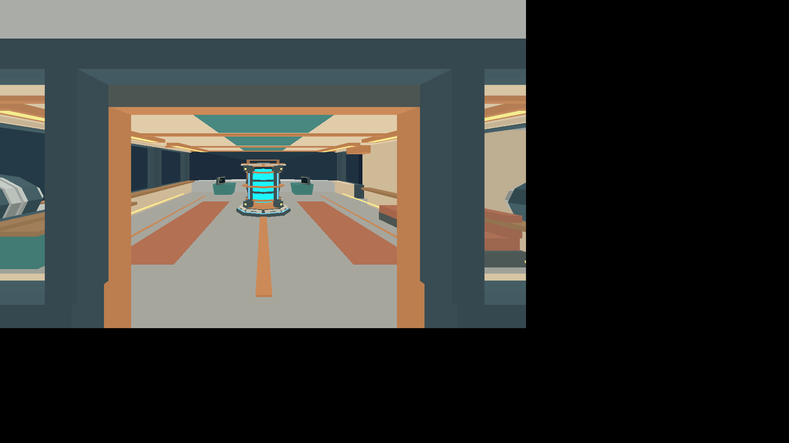
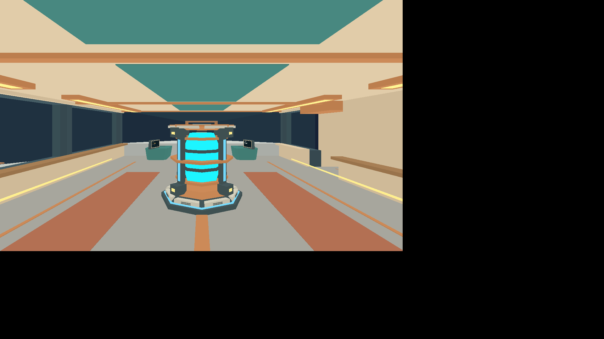
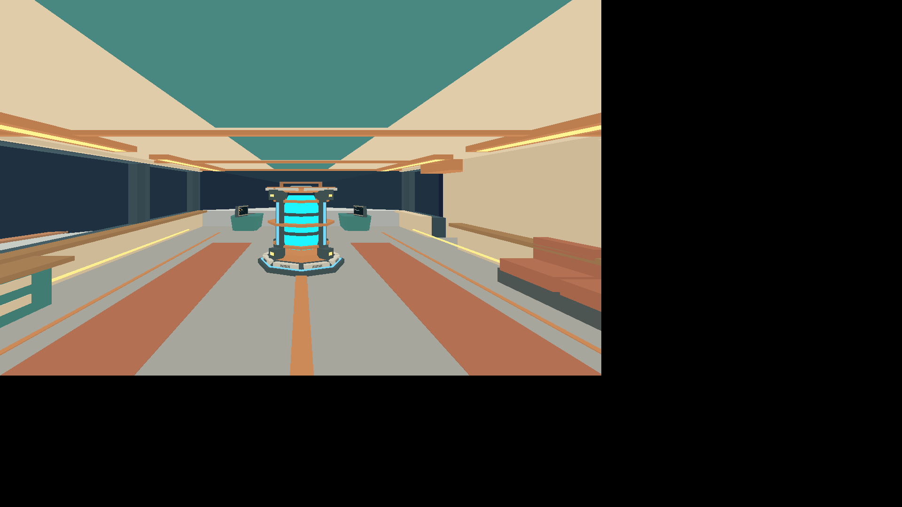

# Issue #35 validation

Airlock interaction now permits landed access and flying access outside the
existing inclusive 3,000,000 m nearby-body telemetry threshold. Nearby flight
and assisted sequences retain their lock; landed takeoff still requires a closed
door. Space exits retain the airlock world position and ship-up view without
planetary projection. Closed gate, hull, rear window and thruster proxies remain
active, and re-entry restores interior movement.

Validation on 2026-10-01:

- Workspace build, rustfmt and Clippy with warnings denied pass.
- All 213 Rust tests and 29 Python runner/build tests pass. Coverage includes
  threshold boundary locking, assistance locking, closing around a space walker,
  height preservation, rear-window obstruction and the real input walkthrough.
- All eight default native scenarios pass, preserving landed access/takeoff,
  cargo traversal, mining, carrying and streaming behavior.
- The airlock evidence scenario passes all 52 steps, with four state/screenshot
  checkpoints: open-space exit, closed-door exterior collision, re-entry, and
  closed-door interior collision. This evidence scenario is required in Linux CI.

[validation.json](validation.json) records assertions, checkpoint player/ship
state and suite results. Full protocol/process logs and per-step state are emitted
by the standard harness in `artifacts/e2e/`. Screenshots below use Linux Xvfb
and software Vulkan; they do not establish native macOS GPU fidelity/performance.
The desktop is 1920×1080 and the E2E game window is 1280×768, with black unused
screen space.

This completes access prerequisites only. Moving-ship inherited velocity and
free 3D inertial EVA are issue #37, and nearby-body transition is issue #36.
No oxygen, pressure, decompression or suit-survival simulation was added.

