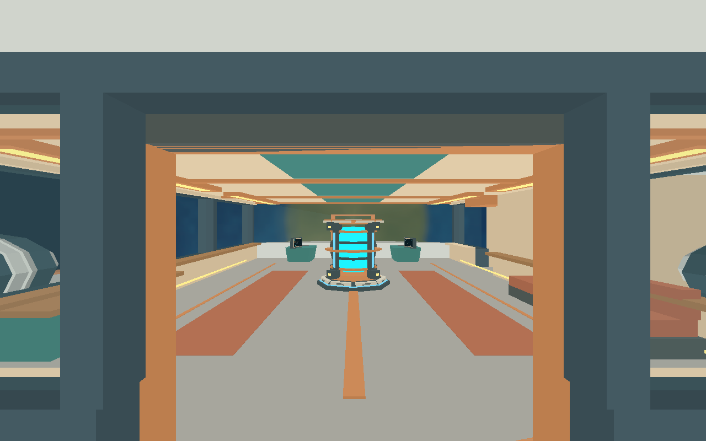
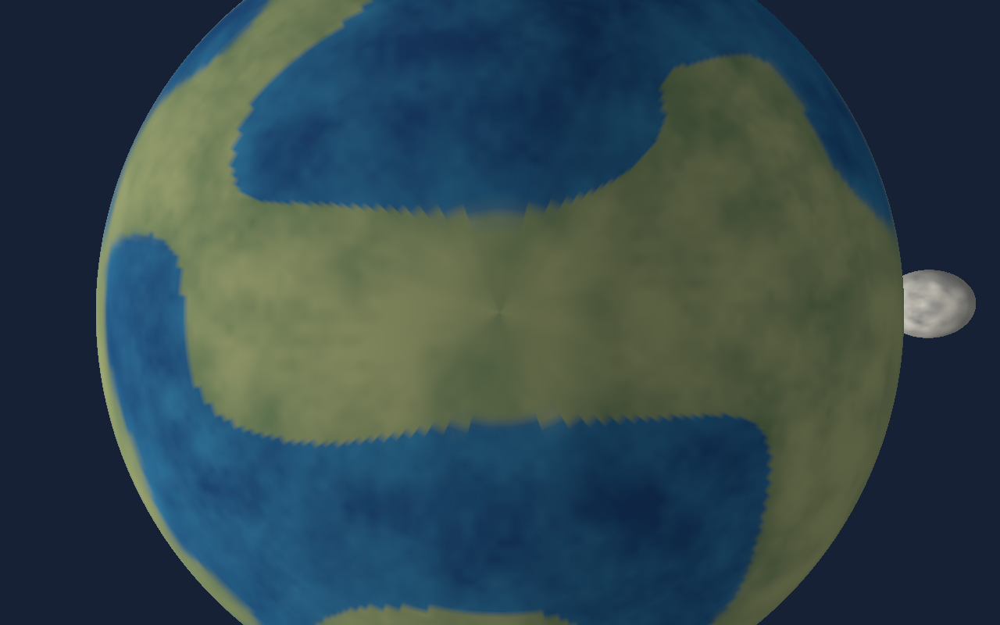

# Issue #36 validation

The inclusive nearby-body surface-distance constant now lives in world and is
re-exported by ship telemetry. Runtime selects solid bodies from player position,
using nearest surface distance and catalog ordering for ties. Nearby airborne EVA
preserves position and inherited motion, adopts radial up and applies fixed
9.81 m/s² gravity once per update. Contact adopts existing surface walking; leaving
influence retains drift; entering the ship clears external influence.

Validation on 2026-10-01:

- Workspace build, rustfmt, Clippy with warnings denied, 222 Rust tests and
  29 Python tests pass.
- World contracts check inclusive threshold selection on all five supported solid
  bodies and exclusion of the Sun. Character contracts check mode changes without
  position/velocity reset, view preservation, exact radial acceleration across
  10/20/100 ms updates, influence exit, selected-surface contact, and interior
  influence clearing.
- The new scenario uses real gameplay actions to leave a radially approaching
  ship at 25,000 m/s, stay outside influence, then cross the threshold. It verifies
  authoritative nearby mode/body, continuous altitude, retained speed and bounded
  radial acceleration. Its portable runtime contract passes.
- All ten default native scenarios pass on three consecutive runs. The final
  45-step evidence scenario passes with three screenshot/state checkpoints and
  is required in Linux CI.

[validation.json](validation.json) records suite results and checkpoint states.
Full per-step state and protocol/process logs are emitted by the shared harness
in `artifacts/e2e/`. Linux Xvfb/Mesa software Vulkan evidence does not establish
native macOS/Windows graphics fidelity or hardware performance.

