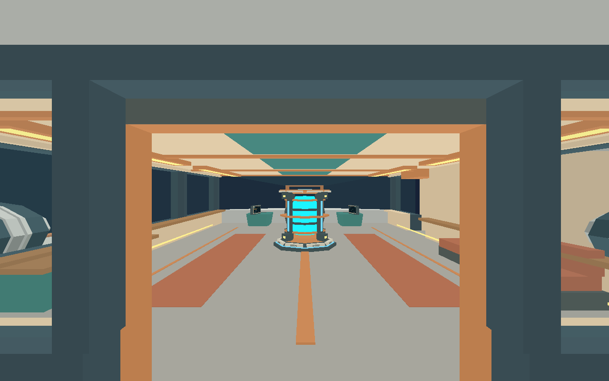
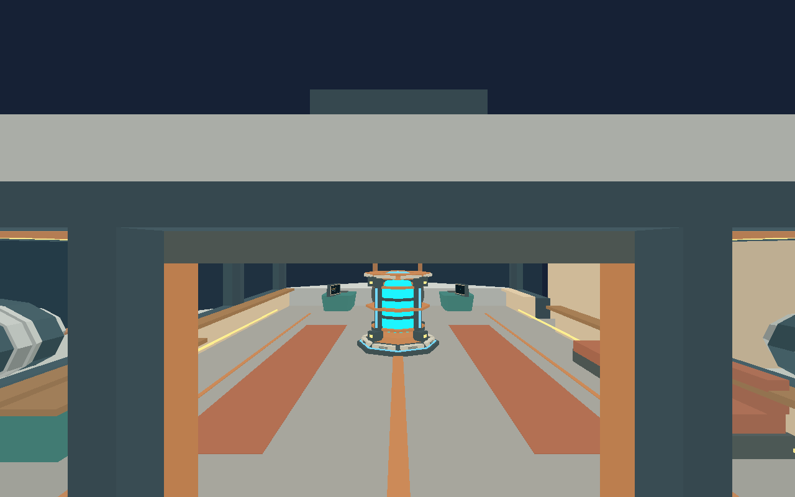
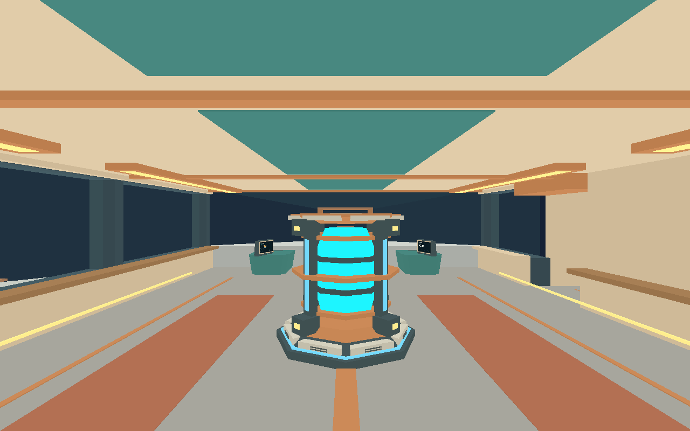

# Issue #37 validation

Flying airlock exits now capture the ship world velocity and orientation. EVA
integrates detached world motion plus normalized camera-relative 3D translation.
WASD follows yaw/pitch, Space ascends and Left Shift descends. Flight assist
commands 3.8 m/s relative translation; release removes commanded motion while
preserving inherited drift. Subsequent ship steering/thrust cannot reset the
player velocity or turn their independent view. Re-entry adopts ship gravity and
velocity and preserves the world look direction.

Validation on 2026-10-01:

- Workspace build, rustfmt, Clippy with warnings denied, all 217 Rust tests and
  all 29 Python runner/build tests pass.
- Character contracts verify exit velocity, 600-frame no-input relative drift,
  independence from later ship velocity/rotation, normalized 3D controls and
  equivalent one-second movement at 10/20/100 ms updates.
- The stationary and moving airlock scenarios execute real portable input and
  gameplay updates. The new moving scenario travels at 25,000 m/s, verifies ten
  seconds of no-input drift, vertical and pitched/yawed movement, assisted stop,
  closed-gate collision, and re-entry.
- All nine default native scenarios pass on three consecutive runs, including
  landed access/takeoff, cargo traversal, mining, carrying and streaming.
- The 84-step moving EVA evidence scenario passes with drift, vertical-flight
  and re-entry state/screenshot checkpoints. It is required in Linux CI.

[validation.json](validation.json) records checkpoint state and suite results.
Full per-step state and protocol/process logs are emitted by the shared harness
in `artifacts/e2e/`. Screenshots use Linux Xvfb and Mesa software Vulkan and do
not establish native macOS/Windows GPU fidelity or performance. Nearby-body
transitions remain the separate dependent issue #36.

