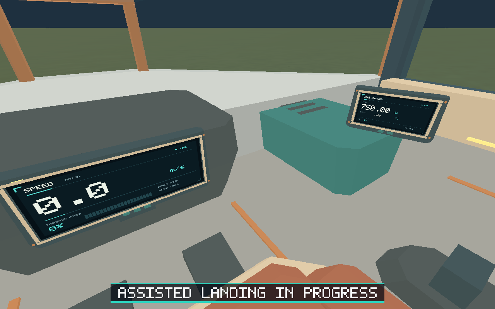
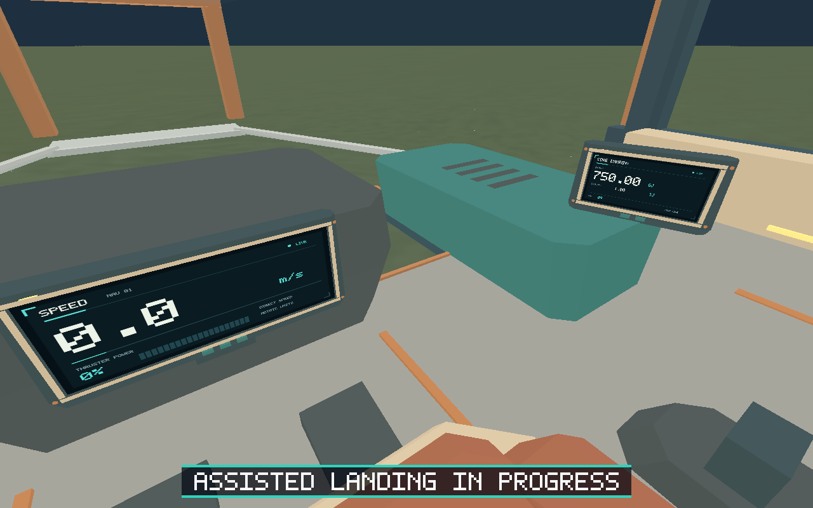
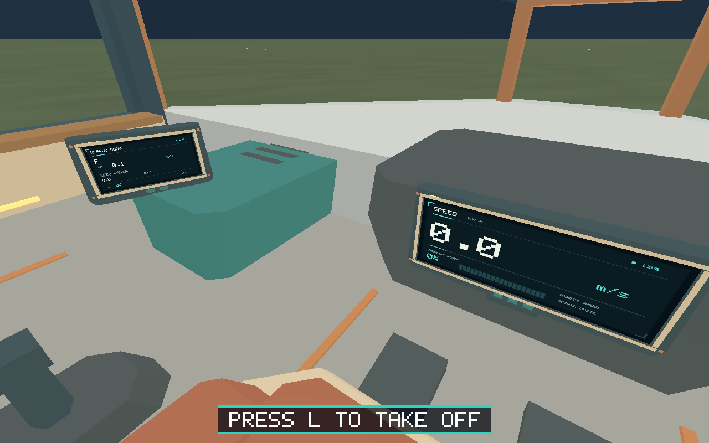
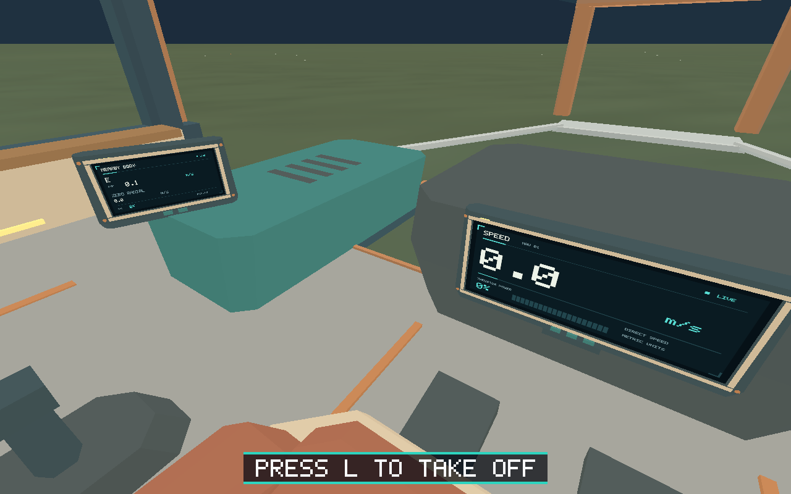
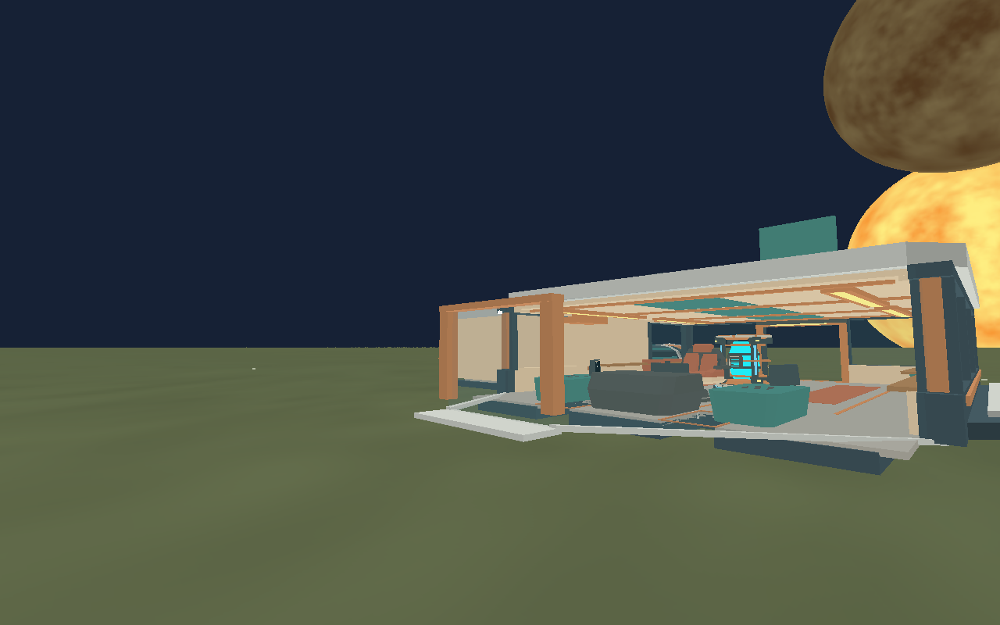

# Issue #38 — lower cockpit windows

Asset version 11 adds lower nose/cheek glazing and two load-bearing glass floor
shoulders beside the center console. The opaque nose, belly and deck have matching
apertures. Copper deck rims make the windows identifiable. All three monitor
assemblies, cockpit controls, seat, interaction markers, main canopy and player
collision remain aligned. The existing floor collision supports the glass panels.

Exported-triangle sightline checks from the seated eye pass on both sides at
12°/18° down and 28° yaw, 26° down / 32° yaw, and 30° down / 34°–36° yaw.
Each ray intersects lower glazing and no opaque mesh. The shared material is
lightly tinted, double-sided alpha-blended glass; the renderer uses reverse-Z
without glass depth writes. Floor normals point up and nose normals point out/down.

## Validation — 2026-10-01

- Locked workspace build, rustfmt check, Clippy with warnings denied: passed.
- All 229 Rust tests and 32 Python tests: passed.
- Deterministic regeneration and glTF/GLB validation: passed; 5,938 triangles,
  120 primitives, 13 materials, 513,824-byte GLB. Existing asset budgets pass.
- Linux native default E2E suite: all 13 scenarios and 1,587 steps passed.
- Matching original version 10 and final version 11 native visual scenarios:
  24 steps each passed. Eight final checkpoint images were inspected, including
  approach, seated low altitude (<25 m), landed port/starboard glazing, forward
  telemetry, takeoff and cockpit exit. Original images show the opaque deck/nose
  where final images expose the green Earth surface through the lower panes.
- Native cargo-room evidence: all 140 steps passed, including cockpit/airlock
  interaction, exterior walking, repeated room movement and takeoff.
- Additional exterior route: 49 steps passed. Ground walking around the ship to
  the forward starboard side shows the matching open lower hull/glazing areas.

Native evidence uses Linux x86_64, Mesa llvmpipe software Vulkan and Xvfb at
1280×800. Xvfb and the test client must run in the same execution/network session;
TCP display `127.0.0.1:83` works with `-nolisten unix -nolisten local -listen tcp`.
Unix display sockets are unavailable here. These captures are actual native
renderer output, not source previews. macOS/Windows GPU behavior and M1 performance
were not tested in this session; no platform-specific rendering code changed.

`native-results.json` records suite summaries and full authoritative screenshot
states. `native-window-result.json` preserves the full primary visual route result.
Build/test/asset/native stderr logs are alongside these files. Original absolute
artifact paths in the raw result identify the producing run; PNGs are copied here
with the same basenames. The shared runner retains protocol logs, per-step states,
process logs and failure captures in its normal `artifacts/e2e/run-*` output.

## Matching native views

| Version 10 | Version 11 |
| --- | --- |
|  |  |
|  |  |



## Reproduce

```sh
python models/assets/ships/salimon-scout/export.py --blender /path/to/blender
python client/assets/ship/source/validate_salimon_phase0_ship.py
cargo build --workspace --locked
python scripts/salimon-test suite
python scripts/salimon-test run scenarios/evidence/lower-cockpit-windows.json \
  --screenshot-command '["python", "scripts/capture_settled.py", "{path}"]'
python scripts/salimon-test run scenarios/evidence/lower-cockpit-exterior.json \
  --screenshot-command '["python", "scripts/capture_settled.py", "{path}"]'
```

The seated visual evidence scenario is mandatory in Linux CI. The exterior
checkpoint is included in the optional complete evidence suite.
