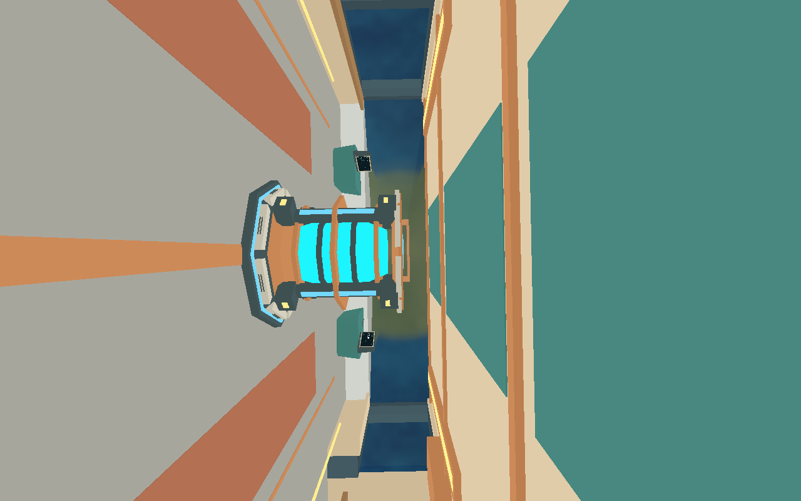

# Issue #39 validation

The `ship-eva` suite groups the cargo walkthrough, stationary airlock access,
moving EVA and nearby-body transition prerequisites. `--evidence` selects their
matching screenshot variants. Required Linux CI now runs the group against its
staged release binary. Missing scenarios and capture failures fail the suite.
The moving route additionally checks the third relative-position axis, ship
velocity, and inherited/relative velocity after re-entry.

```sh
python3 scripts/salimon-test suite --group ship-eva --binary target/debug/salimon-client
python3 scripts/salimon-test suite --group ship-eva --evidence \
  --binary target/debug/salimon-client \
  --screenshot-command '["python3", "scripts/capture_settled.py", "{path}"]'
```

Validation on 2026-10-01:

- Workspace build, formatting, Clippy with warnings denied, 222 Rust tests and
  32 Python tests passed.
- All ten baseline native scenarios passed. The four prerequisites passed on
  three consecutive runs with identical authoritative state at every step.
- All four evidence scenarios passed, producing 15 named screenshot checkpoints
  with ship/player position and velocity snapshots, structured results and logs.
- Moving EVA retains 25,000 m/s inherited motion and holds all three relative
  position axes within 0.02 m over 9.6 seconds without input, then verifies 3D
  translation, stopping, closed-gate collision and interior re-entry.
- Nearby EVA stays in open-space mode outside influence, selects Earth inside
  3,000,000 m, and retains bounded position/velocity under radial gravity.

[validation.json](validation.json) records the gates, repeats and checkpoints.
[evidence.zip](evidence.zip) preserves the four complete evidence directories:
`result.json`, `scenario.json`, every `step-NNN.json`, `protocol.jsonl`, process
logs, capture logs and screenshots. Inspect the result's first failed step for
future regressions, then its state/protocol and screenshot. Archived reports
retain original execution paths; locate screenshots by filename inside the
matching scenario directory after extraction.

These screenshots were inspected on Linux Xvfb with Mesa software Vulkan.
They establish native launch/gameplay/artifact coverage; native macOS/Windows
graphics fidelity and hardware performance still require their own GPU runs.
No resource transfer or physical cargo containment behavior is added here.



