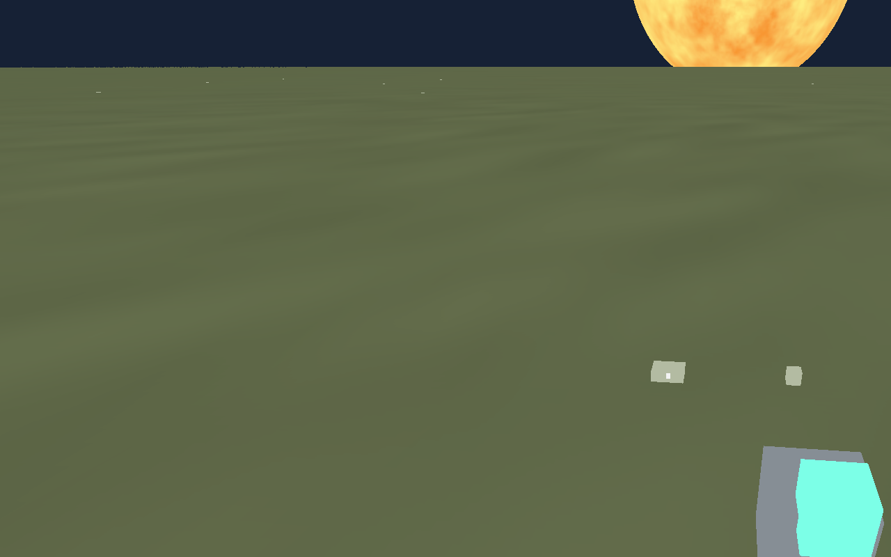
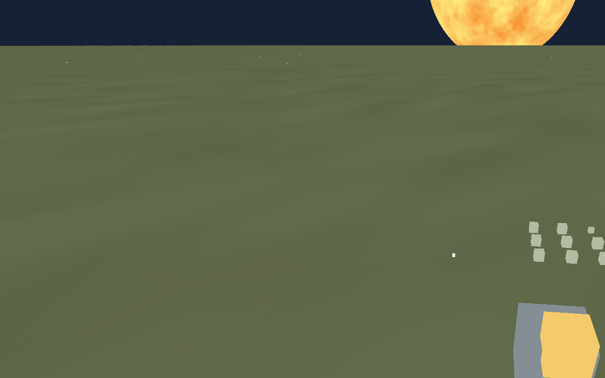

# Issue #45 — Physical mined resource fragments

Validated on Linux with Xvfb and Mesa software Vulkan. The deterministic mining
scenario drives production walking, tool equip, aim/hold/release, and depletion;
it does not insert fixture fragments.

- Partial mining produces one 1.92 kg silicate fragment, with 34.48896041381627 kg
  remaining in the source deposit.
- Depletion produces 19 physical pieces totaling 36.40896041381627 kg, with zero
  remaining deposit mass. The first 18 pieces are 2 kg; the last is fractional.
- Every piece has a unique session ID, source ID, material key, mass, solid
  volume, and finite world pose. Size follows the cube root of volume.
- Zero extraction, loss of aim/range, release, depleted mining, and stowing do
  not create extra material. No resource inventory is credited.

[Authoritative checkpoint state](state-summary.json) accompanies the images.
The runner emits full per-step state, protocol logs, and screenshots under
`artifacts/e2e/`; CI preserves these artifacts and now requires mining capture.

Reproduce with `scripts/salimon-test run scenarios/evidence/mining.json` on a
native GPU desktop. World conservation tests also run without a display using
`cargo test --locked -p salimon-world --test resource_fragments`.

Pieces are currently stationary surface greyboxes, with the last piece growing
as extraction proceeds. Pickup/drop is #46; ship transfer, cargo, and broader
streaming regression coverage remain their separately tracked issues. Reference
macOS/M1 interactive validation was not available in this Linux environment.
