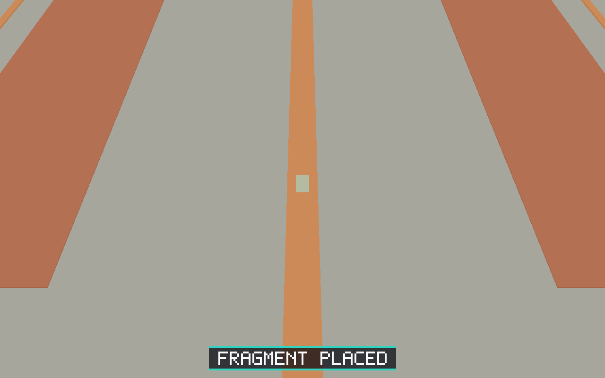
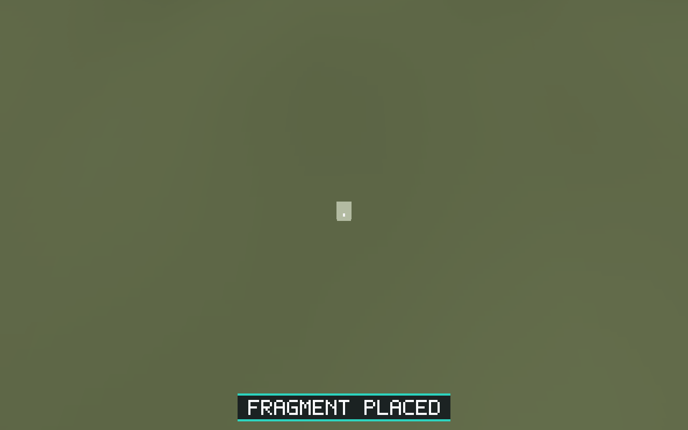
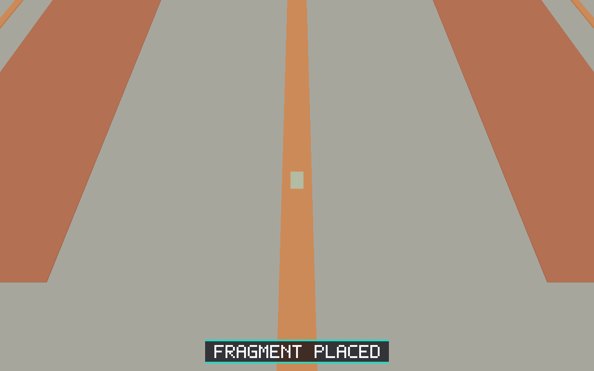
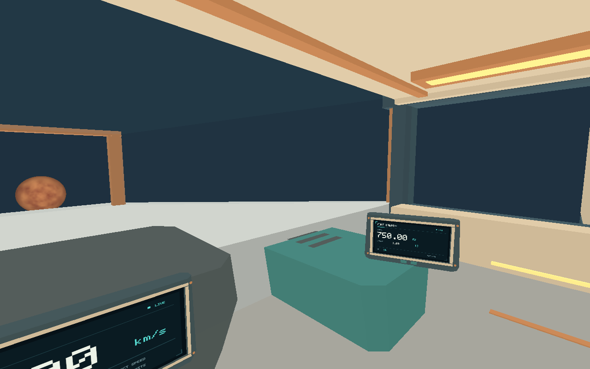
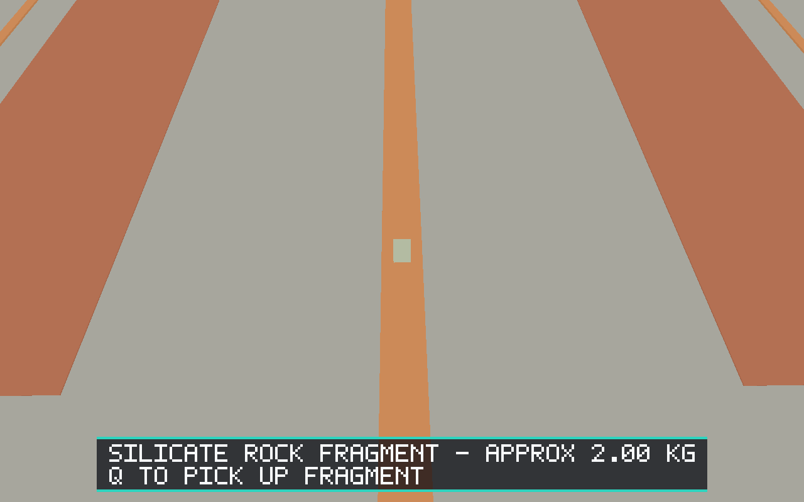

# Issue #47 validation

The deterministic native fragment-transfer evidence run passed all 255 steps.
It mines a real generated deposit, carries fragment 1 through the doorway, places
and retrieves it inside, returns it outside, repeats, and verifies stable
ship-local support during assisted takeoff and 25,000 m/s flight. Fragment
identity, source, 2 kg mass and the session count of 19 remain unchanged.

[validation.json](validation.json) contains compact authoritative checkpoint
states. Full structured results, per-step snapshots, protocol/process logs and
failure capture use the shared runner's `artifacts/e2e/run-*` output; CI preserves
those artifacts rather than committing the 31 MB full state report.

Run from the repository root with a native display and the built executable:

```sh
python scripts/salimon-test run scenarios/evidence/fragment-transfer.json \
  --screenshot-command '["python", "scripts/capture_settled.py", "{path}"]'
```

These captures use Linux Xvfb and Mesa software Vulkan. They validate the native
render/input/protocol path and show the physical fragment/context, not hardware
performance or macOS/Windows graphics. Portable regression tests also cover
rotated ship frames, placement rejection, sight occlusion and repeated transfer.










