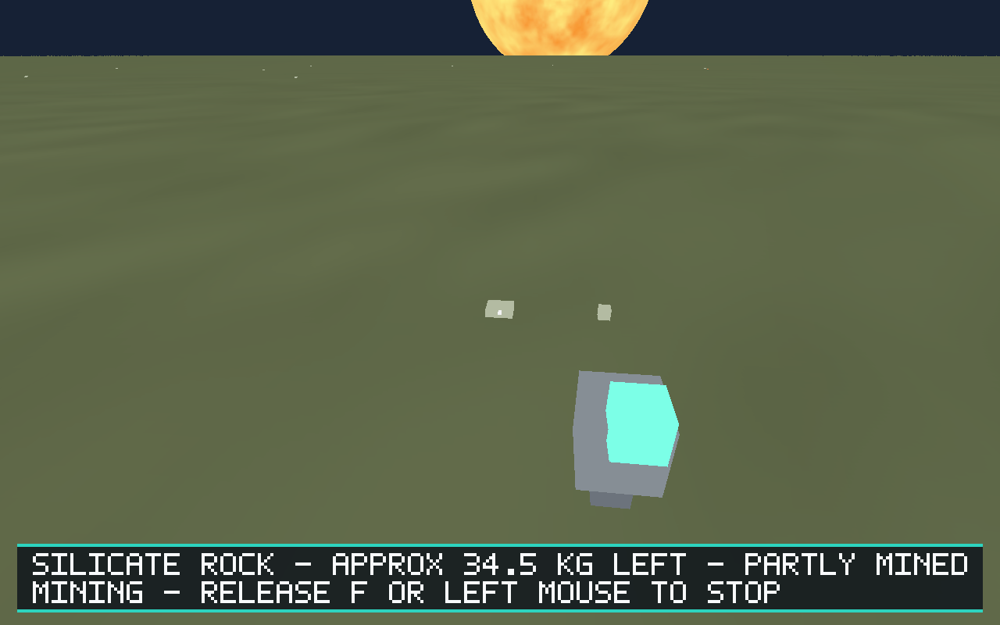
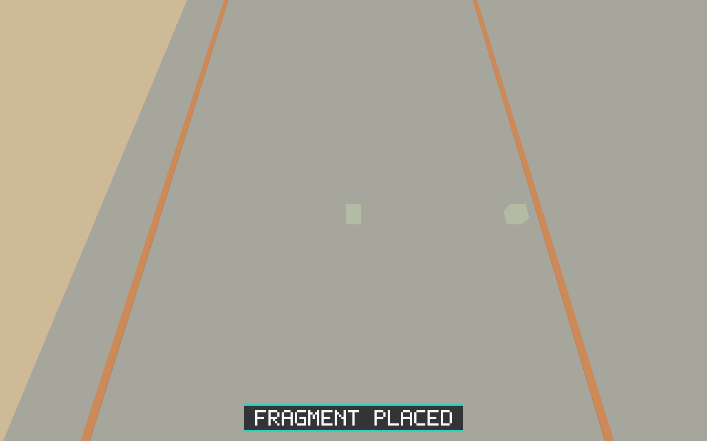

# Issue #52 — first planetary resource loop

The reference route is `scenarios/resource-loop.json`; its evidence variant
adds eleven checkpoints to identical actions/assertions. Run either with
`scripts/salimon-test run PATH`. The required resource evidence suite and default
baseline discovery both include it. See [runner commands](../../scripts/README.md#deterministic-first-resource-loop-52).

## Validated result

Linux native debug client, Rust 1.99.0, Xvfb 1280×800 and Mesa lavapipe Vulkan:
**284 evidence steps passed**, eleven PNG captures, 27.588 seconds. This is
software-renderer gameplay/evidence coverage; macOS/Windows native GPU graphics
were not run here. The local sandbox requires a TCP X display; standard CI uses
the normal Xvfb Unix display. No runner or capture failure was suppressed.

- Assisted landing from 1 km above Earth completed before leaving the cockpit.
- Actual nearby generation exposed iron ore, silicate rock and water ice.
- The stable silicate source produced physical mass/volume/identity; partial
  remaining mass was 34.48896041381627 kg after extracting 1.92 kg.
- Walking beyond 120 m removed the source from active inspection; returning
  restored the same partial mass. Repeating after depletion restored zero mass,
  no visual/target, 19 fragments and conserved 36.40896041381627 kg output.
- Fragments 1 and 2 were each carried through the airlock and cargo passage on
  separate trips. Attempting another pickup while carrying 2 was rejected.
- Final cargo has both original 2 kg silicate fragments, loose and supported in
  the ship frame; neither is carried. This is physical containment, not inventory.

[result.json](result.json) records every step/assertion and capture outcome;
[checkpoints.json](checkpoints.json) records authoritative checkpoint state and
cargo identities/poses. [protocol.jsonl](protocol.jsonl) preserves command ordering
and response acknowledgements, with repeated full states omitted. The shared
runner emits the full per-step state, stdout/stderr and protocol artifacts into
its run directory; CI uploads those unabridged artifacts. The checked-in JSON is
an extracted report, not a replacement for the runner's original result format.

Inspected the physical mining output and final cargo images: both delivered
pieces are visible on the cargo deck. Other captures are diagnostic context;
assertions use authoritative state rather than pixel matching.

## Quality gates

- `cargo build --workspace --locked` passed.
- `cargo fmt --all -- --check` passed.
- `cargo clippy --workspace --all-targets --locked -- -D warnings` passed.
- `cargo test --workspace --locked`: 231 tests passed, zero failed.
- Python build/E2E runner contracts: 34 passed.
- `git diff --check` passed.

Logs are alongside this document. The portable production-action regression
executes the full reference route without a GPU. The new E2E-only initial fixture
changes initial pose only; later actions use the existing gameplay domains.
Refining, crafting, trading, survival consumption, asteroid mining and backend
persistence remain outside this reference scenario.
