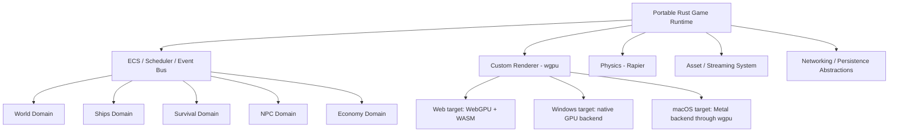
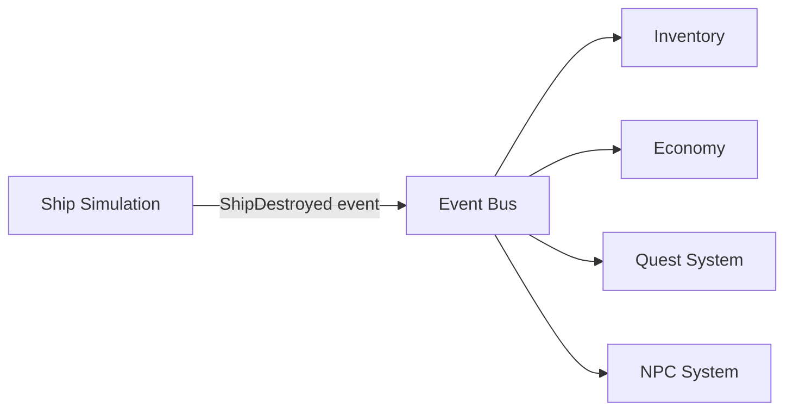
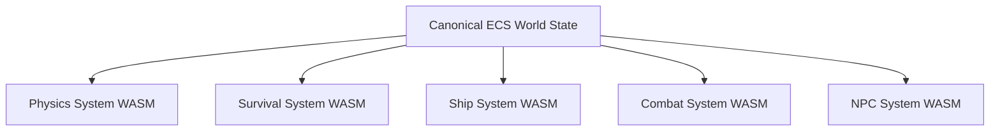
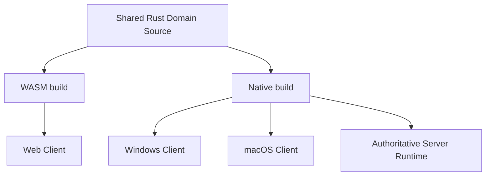
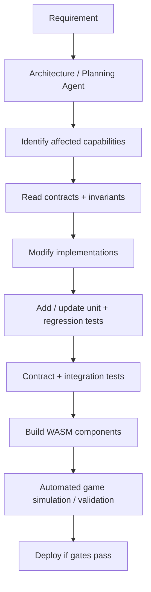

# Technical Architecture & AI Maintenance

> Migrated from the Salimon project documents on 2026-09-29. For current task status and dependencies, use [GitHub issues](https://github.com/mr-exception/salimon/issues).

> **Architecture principle:** Salimon is expected to be implemented and maintained primarily by powerful AI coding agents. Human involvement should stay at the product, architectural, and module-governance level rather than line-by-line maintenance.
# Core Architecture Decision
Use a **custom Rust game runtime with no full game engine**. The game should rely on low-level libraries and explicit module boundaries rather than Unity, Unreal, Godot, Babylon.js, Bevy as a full engine, or another monolithic engine.
- **Rust** is the primary language for the runtime and game-domain implementation.
- **wgpu** is the preferred rendering abstraction so the same renderer architecture can target WebGPU in browsers and native GPU backends on Windows/macOS.
- **winit** is the preferred low-level window/input abstraction for native builds.
- **WebAssembly components / portable Rust modules** remain the architectural boundary for major gameplay and simulation domains where useful.
- **Rapier** is the preferred physics candidate.
- **bevy_ecs may be used only as a standalone ECS crate** if it provides enough value; using it does not imply adopting the Bevy engine.
- **Typed contracts** and capability-based interfaces remain mandatory between domains.
- The architecture must support compiling the same domain source to **WASM for web** and **native code for Windows/macOS**.
# High-Level Runtime

# Module Boundaries
WASM modules should represent meaningful **domains**, not tiny functions. Target roughly tens of major components rather than hundreds or thousands of micro-components.
Potential domains:
- World and entity simulation
- Physics
- Ships and ship construction
- Inventory
- Survival
- Crafting
- Mining and resource processing
- Combat
- Economy
- NPC simulation and behavior
- Missions and quests
- Construction and building
- Procedural generation
- Navigation and pathfinding
- Multiplayer simulation rules
- Persistence-related domain logic
Each module may contain ordinary internal source modules. WASM is primarily the **external architectural boundary**.
# Contracts and WebAssembly Component Model
Prefer the WebAssembly Component Model and **WIT interfaces** for public module contracts. Contracts should explicitly define exported functions, imported capabilities, data structures, errors, and version compatibility.
Example:
```javascript
interface inventory {
    record item {
        id: string,
        quantity: u32,
    }

    add-item: func(entity: u64, item: item) -> result<_, inventory-error>;
    remove-item: func(entity: u64, item-id: string, amount: u32) -> result<_, inventory-error>;
}
```
Different components may be implemented in different languages when useful, for example Rust for high-performance systems and Go for appropriate domain services, provided they expose stable contracts.
# Communication Model
Avoid components directly calling each other's internal code. Prefer **commands, events, and typed interfaces**.
Example event flow:

This allows a component to be replaced or upgraded without requiring unrelated systems to be modified.
# Shared Memory Policy
Do **not** use unrestricted shared memory between all WASM modules. Shared memory creates hidden coupling and makes autonomous maintenance riskier.
Default communication:
- WIT / typed interfaces for commands and queries.
- Event bus for domain events.
- Explicit serialized or structured messages for low-frequency data.
Use shared memory or raw buffers only for performance-critical data pipelines where profiling justifies it, such as:
- Large transform arrays
- Physics state
- Mesh generation results
- High-frequency entity state
- GPU upload buffers
Preferred high-frequency formats include `SharedArrayBuffer`, typed arrays, WASM linear-memory regions, and GPU buffers.
# ECS-Oriented World State
An **Entity Component System** should be considered as the canonical world-state architecture.
Example entity components:
- Transform
- Position
- Rotation
- Velocity
- Mass
- Health
- Inventory
- Ship
- Owner
- Temperature
- Oxygen
- Radiation
Systems operate only on the components they own or consume.

The exact ownership and write rules for ECS components must be documented to avoid multiple modules mutating the same state unpredictably.
# Runtime Host Responsibilities
The custom **Salimon Runtime Host** acts as the operating system for game modules and must be platform-neutral wherever possible. It should:
- Load and initialize domain modules/components.
- Validate component versions and dependencies.
- Schedule ticks, jobs, simulation phases, and worker execution where applicable.
- Route commands and events.
- Expose approved capabilities such as storage, networking, timing, filesystem access, and platform services through interfaces instead of direct platform calls from domain code.
- Coordinate persistence and local cache implementations.
- Coordinate networking.
- Handle module failures and restart policies.
- Provide telemetry, tracing, and profiling.
- Coordinate module upgrades and migrations.
The host should remain relatively small, stable, and heavily tested. Browser-only or OS-specific behavior must live behind platform adapters.
# Platform / Runtime / GPU Split
**Portable Rust runtime**
- ECS / scheduler / event bus
- Game-domain orchestration
- Asset streaming
- Networking abstractions
- Persistence abstractions
- Audio abstraction
- Input abstraction
- Module lifecycle
- Simulation timing
**Game-domain modules**
- Physics and simulation
- Game rules
- Ship simulation
- Survival
- Inventory
- Crafting
- Combat
- Economy
- NPC systems
- Procedural generation
- Pathfinding
- Other deterministic CPU-heavy domain logic
**Custom renderer through wgpu**
- 3D rendering
- Instancing
- Culling
- Particles
- Large asteroid/debris fields
- GPU compute workloads
- Transform and procedural GPU calculations
**Platform adapters**
- Web: WASM, WebGPU, browser storage/network APIs
- Windows: native Rust build, native filesystem/networking, native GPU backend through wgpu
- macOS: native Rust build, native filesystem/networking, Metal backend through wgpu
# Client, Native and Server Reuse
Game-domain source should be written so the same module can be compiled for multiple targets.

The reusable asset is therefore **portable domain source plus strict contracts**, not merely the `.wasm` artifact. Web builds may use WASM; native builds may link the same modules directly or compile them into native libraries/binaries for better performance. The server remains authoritative for multiplayer-sensitive state.
# AI-Maintenance Design Rules
The architecture must optimize for **small reasoning scope**. An AI agent should be able to modify one capability without loading the entire repository into context.
Every major component should include:
- `interface.wit` or equivalent public contract
- `README.ai.md` with component purpose and ownership
- `architecture.md`
- `invariants.md`
- Unit tests for module/package-owned logic
- Regression tests for previously fixed bugs and fragile behavior
- Contract tests for public interfaces and cross-module expectations
- Integration tests where multiple modules or packages interact
- Benchmarks for performance-sensitive modules
- Dependency metadata
- Version and compatibility policy
## Testing and Regression Policy
Testing is part of implementation, not a later cleanup step.
- Every module, crate, package, and reusable subsystem must include focused automated tests for the behavior it owns.
- New logic should normally be introduced together with unit tests in the same task/change.
- Every bug fix should add a regression test that reproduces the failure and proves it stays fixed whenever practical.
- When intentional behavior changes, update the relevant tests in the same change so the suite describes the new contract.
- Cross-module behavior should be protected with contract or integration tests at the narrowest useful boundary.
- Avoid relying only on end-to-end/manual gameplay validation; failures should be diagnosable at the smallest responsible module where possible.
- A module/package should not be considered complete while its important invariants and expected edge cases are untested.
- The automated test suite must remain runnable by AI agents and CI so changes can be validated without human-only verification.
Example metadata:
```yaml
name: survival
version: 4.3.1

exports:
  - apply-damage
  - eat
  - drink
  - update

requires:
  - inventory@^3
  - world@^2

events:
  publishes:
    - player.died
    - player.hungry
  consumes:
    - environment.temperature_changed
```
# Invariants
Each component must document non-negotiable rules independently from implementation details.
Example inventory invariants:
1. Item quantity can never be negative.
2. Containers cannot exceed defined capacity rules.
3. Item identifiers are immutable.
4. Item movement is atomic.
5. Entity destruction must follow explicit inventory-destruction or transfer rules.
AI agents must treat invariants as part of the component contract and update tests whenever behavior intentionally changes.
# Versioning
Public component interfaces must be versioned aggressively.
Examples:
- `salimon:inventory@1`
- `salimon:inventory@2`
- `salimon:ships@3`
A new incompatible interface should create a new major version rather than silently breaking consumers. Old versions may remain available during migration.
# Autonomous Change Workflow
## Task worker selection
- The Tasks database includes a `Worker Suggestion` property containing the recommended model and reasoning level for each task.
- When Codex selects a task to execute, it should read that property before implementation and switch the worker to the suggested model and reasoning level for that task when the selected environment supports it.
- If the exact suggested model or reasoning level is unavailable, use the closest available capability tier and record the substitution in the task notes.
- The suggestion is an execution default, not permission to weaken requirements, tests, acceptance criteria, or architectural constraints.
Expected AI implementation workflow:

Repository-wide changes should require explicit architectural reasoning and dependency-impact analysis rather than allowing an agent to modify arbitrary modules opportunistically.
# Performance Principles
WASM should not be used merely because a module exists. It is a portability and isolation tool, not the definition of the runtime.
- Keep rendering inside the custom `wgpu` renderer rather than a full game engine.
- Compile portable Rust source to native code on Windows/macOS when native execution offers a clear benefit.
- Avoid JSON for per-frame high-volume state exchange.
- Prefer typed buffers and explicit binary layouts for high-frequency data.
- Use workers/threads for expensive simulation where the target platform supports them appropriately.
- Profile before introducing shared-memory optimizations.
- Preserve deterministic simulation where client/server reuse, rollback, replay, or catch-up simulation is useful.
# Current Technology Direction
Current canonical direction:
- **No full game engine.** Salimon uses a custom runtime assembled from low-level libraries.
- **Rust** is the primary runtime and game-domain language.
- **wgpu** is the preferred rendering layer so one rendering architecture can target browser WebGPU, Windows native GPU backends, and macOS Metal.
- **winit** is the preferred native window and input abstraction.
- **Rapier** is the preferred physics candidate.
- **bevy_ecs** may be evaluated as an ECS library only; the Bevy engine itself is not part of the architecture.
- **WIT / WebAssembly Component Model** remains useful for stable public contracts and WASM-host boundaries where appropriate.
- **WASM** remains the web compilation target for portable Rust modules, but the first client is native macOS rather than browser-first.
- **macOS native is the first playable client target.** Windows native and web remain later targets using the same portable domain architecture.
- **IndexedDB** is the browser persistence/cache implementation; native builds should use platform-appropriate storage behind the same capability interface.
- **Authoritative server** remains responsible for multiplayer-sensitive world state, with shared deterministic Rust domain code where practical.
- UI should also be treated as replaceable/platform-specific rather than forcing core gameplay to depend on React or another browser framework.
- The first playable build should target smooth performance on the reference **Apple M1 iMac** (`iMac21,1`, `Z12X002L9GR/A`, 8-core CPU/GPU, 16 GB unified memory), making performance budgets and scalable rendering mandatory from the beginning.
# Architectural Goal
The system should make the following type of change safe for an autonomous agent:
> Add oxygen tanks to spaceships.
The agent should be able to determine that the change affects `ships`, `survival`, and possibly `inventory`; inspect only those contracts, invariants, tests, and dependency declarations; implement the change; run automated validation; and leave unrelated domains untouched.
This is the primary maintainability objective of Salimon's technical architecture.
# Large-Scale Coordinates and Camera Precision
Salimon uses a **right-handed world coordinate system with ****`+Y`**** up and meters as the canonical unit**.
- Authoritative world and camera positions remain CPU-side `f64`.
- Each frame, rendering converts absolute world positions into camera-relative coordinates by subtracting the camera position in `f64` before converting the resulting small relative values to GPU `f32`.
- Do not upload universe-scale absolute positions as `f32`, and do not rely on WGSL to subtract large absolute coordinates.
- The renderer uses a `Depth32Float` **infinite-far reverse-Z projection** with depth clear `0` and greater-depth comparison. The physical near plane remains explicit and configurable.
- Camera rebasing is sufficient for small validation scenes, but it is **not** the long-term universe representation. Large bodies, terrain patches, meshes, and universe-scale content should use body-local or patch-local geometry within a documented spatial hierarchy.
- Prototype distances, anchors, FOV, near-plane values, transition timing, colors, and proxy geometry used by coordinate/camera validation tasks are test fixtures only. They do not define canonical Solar System layout, body placement, ship behavior, camera feel, or final visual tuning.
# Implemented Phase 0 Asset Boundary
Task 7 establishes `client/assets/ship/` as the renderer-neutral source/export boundary for the custom Salimon ship. The checked-in contract is:
- deterministic procedural authoring source and readable glTF interchange remain editable;
- self-contained GLB is the runtime artifact;
- units are meters with `+Y` up, `+X` ship-forward, and `-Z` starboard;
- stable named Exterior, Interior, Collision_Proxies, and Interaction_Markers groups carry gameplay-facing metadata without depending on renderer, world, character, or ship code;
- collision proxies are metadata-only and therefore do not add draw calls;
- asset budgets and licensing are explicit and validated before commit.
The initial asset was committed as `042f7ae` with 620 triangles, 41 primitives, nine reused materials, one tiny original texture, a 77,032-byte GLB, and no external asset dependencies. The first-person character and walkable ship integration was completed in the task now ordered as Task 11 while keeping character and ship behavior in their owning modules.
## Phase 0 playtest-driven asset follow-ups
Tasks 8–10 are the immediate Phase 0 priorities after the Task 7 asset baseline: correct reversed horizontal mouse look, add cockpit windows with usable exterior sightlines, and scale the ship uniformly to at least 2× its baseline linear dimensions. Scaling or revising the asset must update editable source, glTF/GLB exports, renderer inputs, collision proxies, interaction markers, player/seat/door anchors, landed placement, camera assumptions, tests, and maintenance documentation as one coherent contract change.
