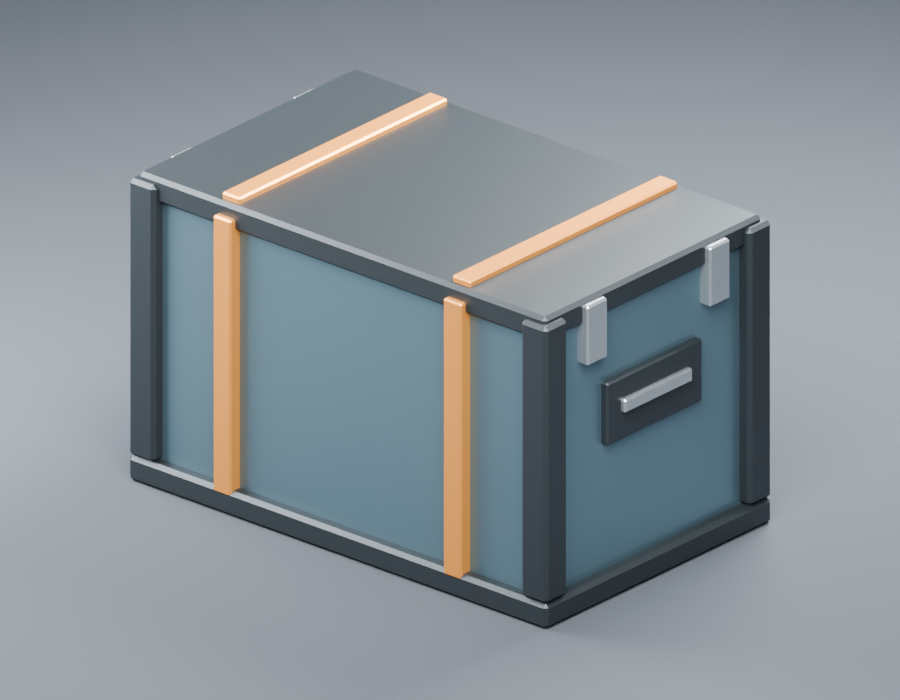

# Cargo container

`item.cargo-container` is the first Blender-authored item exported through the
shared asset pipeline. `source.blend` is its editable visual source of truth.
It was authored with Blender 4.5.3 LTS using Blender Python automation. Geometry
and materials are original Salimon work, with no external assets, textures,
linked libraries, add-ons, or third-party licensing requirements. This records
provenance without introducing a new repository license.



The preview was rendered after re-importing the checked-in runtime GLB. Its
camera, lights, and floor are presentation helpers, absent from the saved source
and runtime export.

## Design and contracts

A closed teal metal container has dark chamfered corner protection, orange
protective bands, and silver handles and latch plates. Its triangulated mesh is
editable in Blender; no modifiers, rigs, or animations need baking. The lid,
handles, and latches are static visual details, not articulated interactions.

| Contract | Value |
| --- | --- |
| Source frame | Metric unit scale 1; +Z up, +X forward |
| Source bounds | X: -0.40…0.40 m, Y: -0.25…0.25 m, Z: 0…0.50 m |
| Runtime bounds | X: -0.40…0.40 m, Y: 0…0.50 m, Z: -0.25…0.25 m |
| Pivot | Bottom center of the bounds |
| Hierarchy | `ASSET_cargo-container` → `Visual` → `Cargo_Container` |
| Object transforms | Identity; shape and pivot baked into mesh vertices |
| Materials | `Cargo_Panel`, `Cargo_Frame`, `Cargo_Trim`, `Cargo_Latch` |
| Root extras | `salimon.assetId = item.cargo-container` |
| Mesh extras | `salimon.role = cargo-container-visual` |
| Collision | Explicitly `none`; no authored proxies or implicit mesh collider |
| Sockets / markers / LODs | None required for this standalone static visual |

The generic `standard-v1` contract is sufficient; no item-specific extension or
validator is needed. Grip sockets are unnecessary until a consumer defines a
held-item attachment contract. This asset proves ordinary item authoring and
export only. Storage capacity, carrying limits, placement, collision, and opening
behavior remain in their gameplay domains. Runtime consumer integration is a
separate task; current gameplay does not load this GLB.

## Edit and export

Open `source.blend` and edit `Cargo_Container` in Edit Mode. Preserve the named
hierarchy, metadata, material roles, identity transforms, and bottom-centered
metric pivot. Save before exporting. Use the optional Python dependencies from
[the tooling guide](../../../tools/README.md), then run from the repository root:

```sh
python models/tools/export_asset.py item.cargo-container --blender /path/to/blender
python models/tools/validate_asset.py item.cargo-container
BLENDER=/path/to/blender python -m unittest discover -s models/tests -v
```

The manifest selects `client/assets/items/cargo-container/model.glb`. Normal
Cargo builds consume checked-in assets and do not need Blender.

## Validation evidence

The initial Blender 4.5.3 export passed shared validation: 924/1,000 triangles,
4/4 primitives, 4/4 materials, 0/1 texture bytes, and 72,568/131,072 GLB bytes.
The positive texture-byte cap of 1 satisfies the schema while effectively
requiring a texture-free export. All 23 model pipeline tests passed with real
Blender integration enabled. A second shared export produced identical bytes.
Re-import verified the 0.80 × 0.50 × 0.50 m dimensions and preserved metadata;
the exported preview was visually inspected. The legacy scout validator passed.
