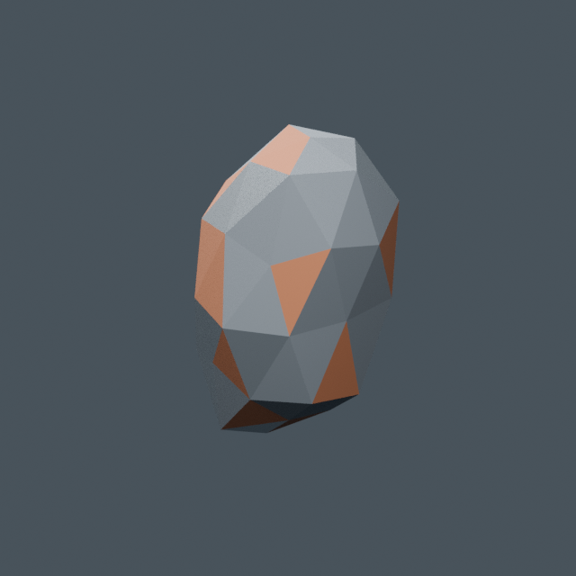

# Iron fragment — shard variant

`resource.iron-fragment-shard` is an original Salimon variant evolved from
[the existing iron chunk](../iron-fragment/README.md), retaining its 42 editable
vertices, 80 triangles and three material roles. It has a narrower, taller,
asymmetric silhouette: source X becomes `0.53*x + 0.19*z`, Y becomes `0.73*y`,
and Z becomes `1.28*z`, applied to the centered chunk's mesh vertices. Source Z
maps to runtime Y. No additional components, external assets or licenses.



Source adapted with Blender 4.0.2; `source.blend` remains editable. Preserve
`ASSET_iron-fragment-shard` → `Visual` → `Iron_Fragment`, identity node transforms,
root `salimon.assetId = resource.iron-fragment-shard` and mesh
`salimon.role = fragment-visual`. Materials are `Iron_Ore`, `Iron_Inclusions` and
`Oxide_Crust`. Metric unit scale 1; generic export maps source `(x,y,z)` to
runtime `(x,z,-y)` once. Pivot is the physical cube center; all vertices stay
inside ±0.48 m (runtime Y ±0.4224 m). No colliders, sockets, textures or LODs.

Odd fragment IDs use this variant. Runtime uniformly scales by physical cube
side and positions at the authoritative center. Mass, volume, mining, carrying,
dropping, placement/contact and session persistence remain gameplay-owned.
Preview uses Blender lighting; runtime uses flat base colors and facet shading.

```sh
python models/tools/export_asset.py resource.iron-fragment-shard --blender /path/to/blender
python models/tools/validate_asset.py resource.iron-fragment-shard
BLENDER=/path/to/blender python -m unittest discover -s models/tests -v
```

Current shared metrics: 80 triangles, three primitives/materials, no textures,
11,492 GLB bytes. Cargo embeds the checked-in export without Blender.
