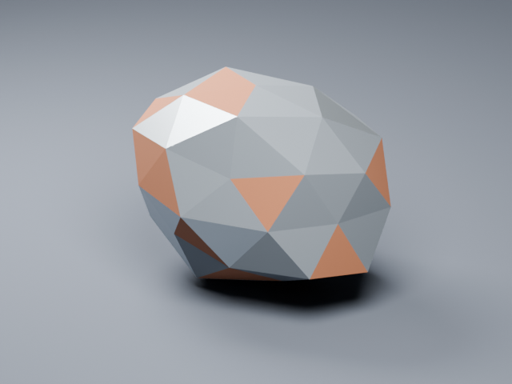

# Iron fragment

`resource.iron-fragment` is the first original Blender-authored resource asset.
The saved `source.blend` is the editable visual source of truth; edit its mesh
and materials in Blender, then use the shared exporter. It was authored with
Blender 4.5.3 LTS using Blender Python automation. No add-ons, external assets,
textures, linked libraries, or third-party licenses are required. The geometry
and materials were created specifically for Salimon; no third-party content was
copied. This records provenance without introducing a new repository license.



The preview was rendered from the re-imported runtime GLB. Its floor, camera,
and lighting are presentation helpers and are absent from the saved source and
runtime export.

## Design and contracts

A small irregular, flat-shaded ore fragment has dark iron faces, bright metallic
inclusions, and brown oxide patches. All 42 vertices and 80 triangular faces
are directly editable; materials are ordinary glTF metallic/roughness materials.
There are no modifiers or animations to bake.

| Contract | Value |
| --- | --- |
| Source frame | Metric unit scale 1; +Z up, +X forward |
| Source bounds | X: -0.20…0.20 m, Y: -0.16…0.16 m, Z: 0…0.30 m |
| Runtime bounds | X: -0.20…0.20 m, Y: 0…0.30 m, Z: -0.16…0.16 m |
| Pivot | Bottom center of the bounds; orientation has no gameplay meaning |
| Hierarchy | `ASSET_iron-fragment` → `Visual` → `Iron_Fragment` |
| Object transforms | Identity; shape and pivot baked into mesh vertices |
| Materials | `Iron_Ore`, `Iron_Inclusions`, `Oxide_Crust` |
| Root extras | `salimon.assetId = resource.iron-fragment` |
| Mesh extras | `salimon.role = fragment-visual` |
| Collision | Explicitly `none`; no authored proxies or implicit mesh collider |
| Sockets / markers / LODs | None needed for this standalone visual |

This asset proves resource export with the generic `standard-v1` contract.
It needs no category extension or ship-specific tooling. Its identity describes
art, not mining yield or resource-domain policy. It is checked in for later
consumer integration; current gameplay fragment rendering remains unchanged.

## Edit and export

Open `source.blend`, edit `Iron_Fragment` in Edit Mode, and preserve the hierarchy,
names, custom properties, identity transforms, and bottom-centered metric pivot.
Keep the three material roles and validate budgets after visual changes.
Save the source before exporting. Run from the repository root with the optional
Python dependencies in [the tooling guide](../../../tools/README.md):

```sh
python models/tools/export_asset.py resource.iron-fragment --blender /path/to/blender
python models/tools/validate_asset.py resource.iron-fragment
BLENDER=/path/to/blender python -m unittest discover -s models/tests -v
```

The manifest selects `client/assets/resources/iron-fragment/model.glb`.
Cargo consumes checked-in assets and never opens Blender.

## Validation evidence

The initial Blender 4.5.3 export passed shared validation and all 23 model
pipeline tests, including real Blender resource/item integration. Measured
budgets are 80/100 triangles, 3/3 primitives, 3/3 materials, 0/1 texture bytes,
and 11,432/16,384 GLB bytes. The positive texture-byte cap of 1 satisfies the
schema while effectively requiring a texture-free export. Re-importing the GLB
in Blender verified its 0.40 × 0.32 × 0.30 m source-frame dimensions, and the
exported preview was inspected. A second shared export produced identical bytes.
