# Issue #111 — Blender-authored scout traversal geometry

Implemented on 2026-10-06 against `cff2443` (main).

## Outcome

Scout traversal geometry now comes from the linked Blender components through
one generated `client/character/src/spatial_contracts.rs`. The existing public
anchors and floor-height API remain compatible. Normal Cargo builds consume
checked-in exports; Blender is only an offline authoring dependency.

Added five nonvisual authored boxes: clear cabin traversal envelope, cabin-only
exterior envelope, pilot chair, and port/starboard cockpit hull. Added a doorway
transition marker separate from the exit interaction marker. Existing floor,
nose, door, Core, console, engines and wings supply the remaining dimensions.
The inventory is now 20 boxes and four markers. These conservative proxies retain
the previous walking limits; the GLB geometry `.bin` is byte-identical to base.
Visual triangle/material counts remain 5,890/13 with 109 primitives, no added draw
calls; metadata increases GLB size to 484,796 bytes within its 512 KiB budget.

Character layout still owns body clearance, gate splitting, nose-shoulder
composition and conservative sight/floor query policy. Player radius/height,
gravity, timing, camera offsets, permission, carrying and interaction rules stay
in Rust. Missing/renamed nodes, malformed/nonfinite dimensions, transformed
parents, visual/rotated/scaled proxies, asymmetric centered widths and nonlevel
floors fail validation with the broken contract identified. Failed export staging
continues to preserve published files. Asset/character/architecture/maintenance
and generated-file guides document the mapping.

## Validation

Environment: Linux x86_64; Rust 1.99.0; Python 3.12.14; Blender 4.5.3 LTS.
Native evidence uses the current debug executable, software Vulkan (Mesa
lavapipe) and a dedicated Xvfb 1280×800 test display. Build prerequisites were
supplied from `/tmp/salimon-native`; native runs start Xvfb in the same process
namespace as the runner. An initial separate-display attempt could not connect;
all listed scenarios were rerun successfully with captured screenshots.

| Command | Result |
| --- | --- |
| `python models/assets/ships/salimon-scout/export.py --blender /tmp/blender-4.5.3-linux-x64/blender` | Passed; validated, regenerated and published all outputs |
| `BLENDER=/tmp/blender-4.5.3-linux-x64/blender python -m unittest discover -s models/tests -v` | 53 passed, including real Blender source/interchange and linked-component propagation checks |
| `python models/assets/ships/salimon-scout/validate.py` | Passed, including generated module/sidecar equality |
| `cargo fmt --all -- --check` | Passed |
| `cargo clippy --workspace --all-targets --locked -- -D warnings` | Passed |
| `cargo test --workspace --locked` | 260 passed, including 60 character regressions |
| `cargo build --workspace --locked` | Passed without Blender |
| `python -m unittest discover -s scripts -p 'test_*.py'` | 34 passed |
| `python scripts/salimon-test suite --group ship-eva --evidence --binary artifacts/build/debug/salimon-client --screenshot-command '["python", "scripts/capture_settled.py", "{path}"]'` | All 4 passed; screenshots captured |
| `python scripts/salimon-test suite --group resource-collection --evidence --binary artifacts/build/debug/salimon-client --screenshot-command '["python", "scripts/capture_settled.py", "{path}"]'` | All 6 passed; carrying, floor placement and fragment transfer included |
| `python scripts/salimon-test run scenarios/evidence/lower-cockpit-windows.json --binary artifacts/build/debug/salimon-client --screenshot-command '["python", "scripts/capture_settled.py", "{path}"]'` | Passed; screenshots captured |
| `git diff --check` | Passed |

Native commands use `WGPU_BACKEND=vulkan`, `VK_DRIVER_FILES=/tmp/salimon-lvp.json`,
`DISPLAY=127.0.0.1:112` and the prerequisite prefix's PATH/LD_LIBRARY_PATH.
Rust build/test commands reused the existing Cargo target cache, with
`PKG_CONFIG_SYSROOT_DIR=/tmp/salimon-native` and its pkgconfig directory on
`PKG_CONFIG_PATH`.

## Evidence and limits

[Structured results and captured states](validation.json) cover all eleven native
scenarios. These checks establish Linux software-rendering/state coverage, not
macOS/Windows GPU fidelity or reference hardware performance. Release staging,
packaged OS-input smoke and the unrelated full baseline suite were not run
locally; native CI remains the broader platform gate. No gameplay policy or
visual redesign was introduced.

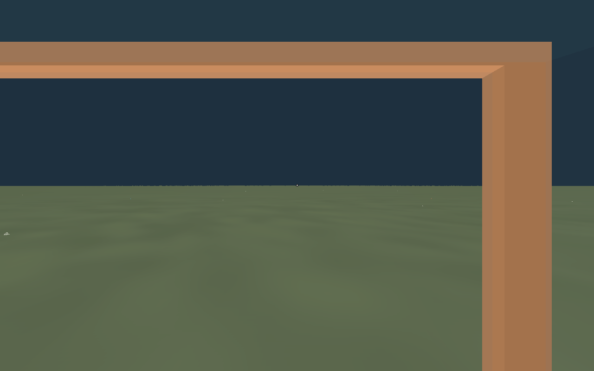

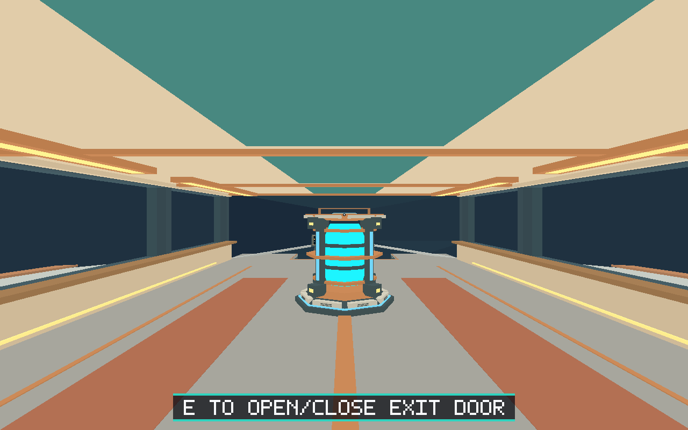

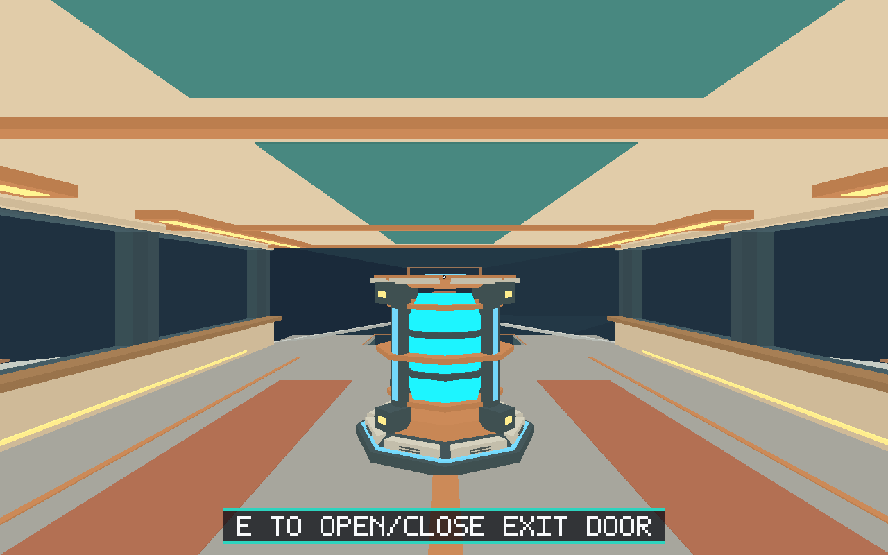

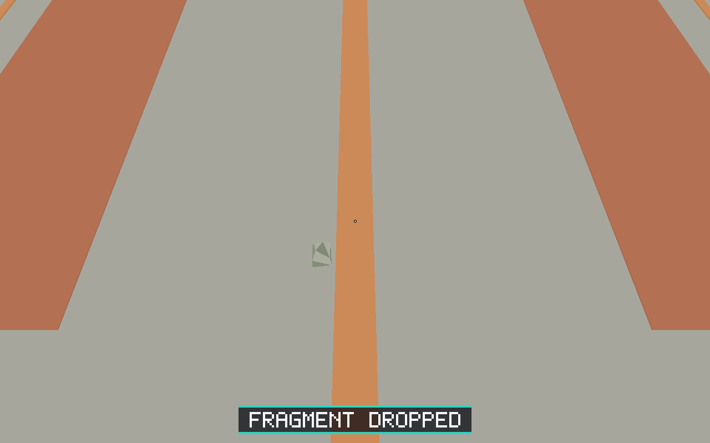

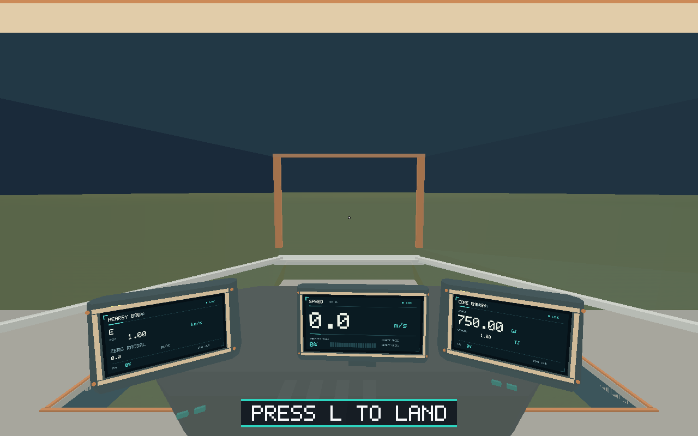

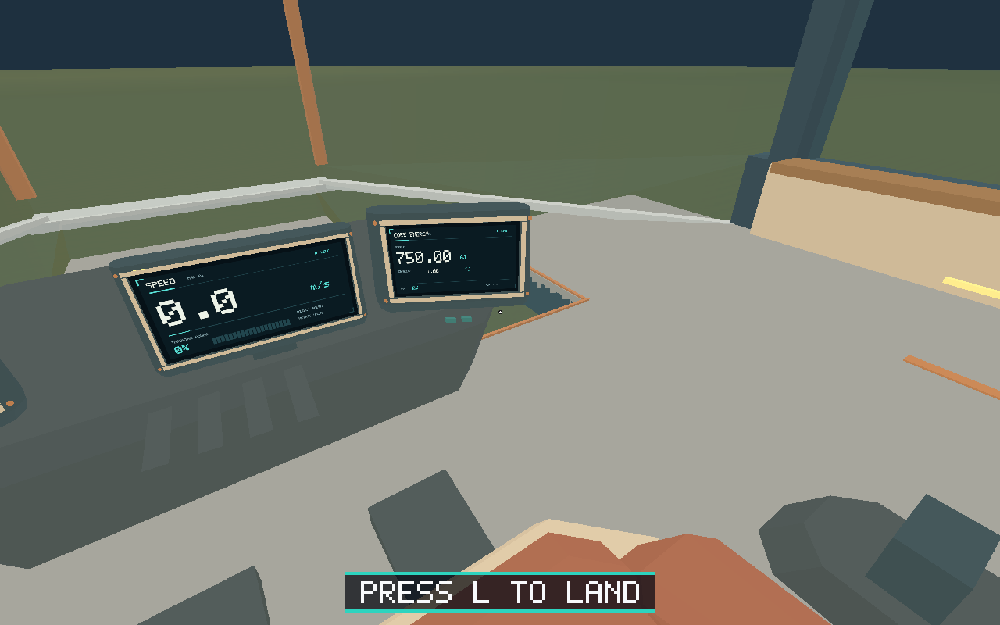

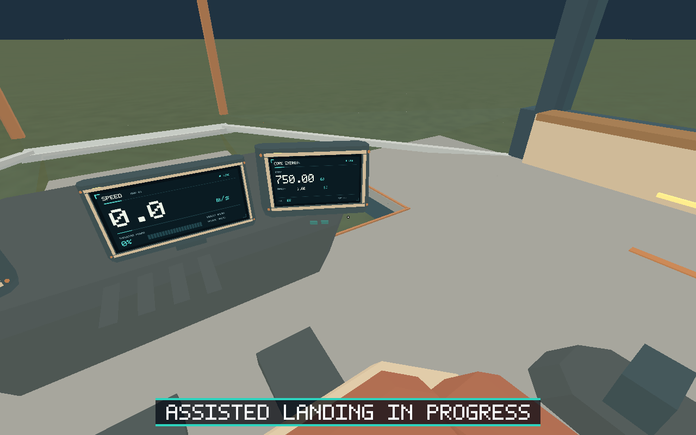

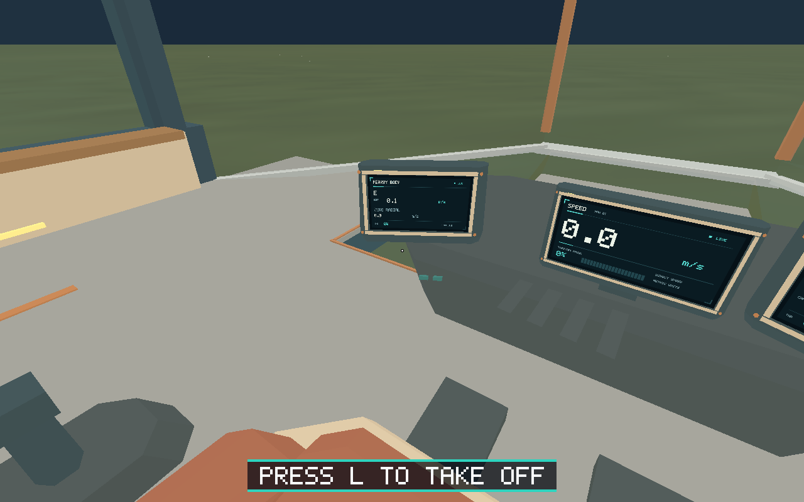

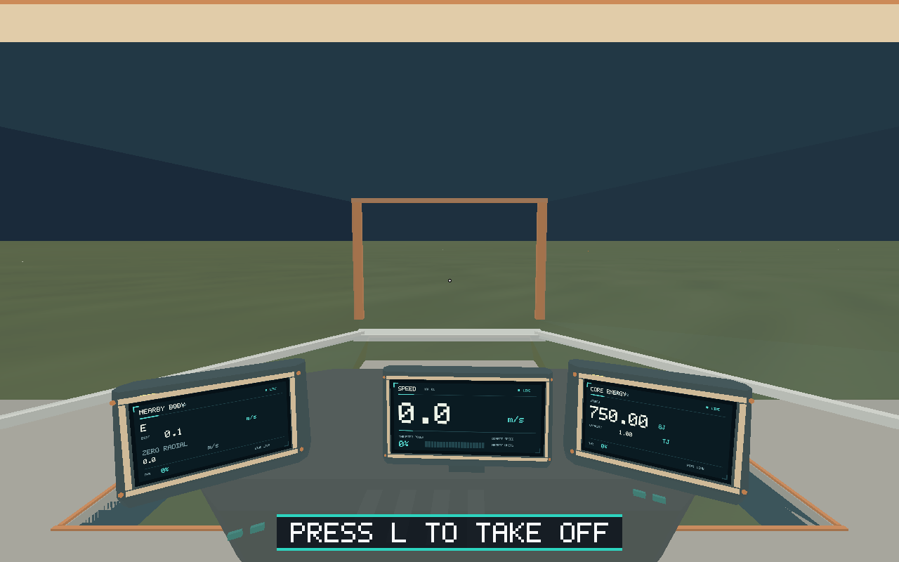

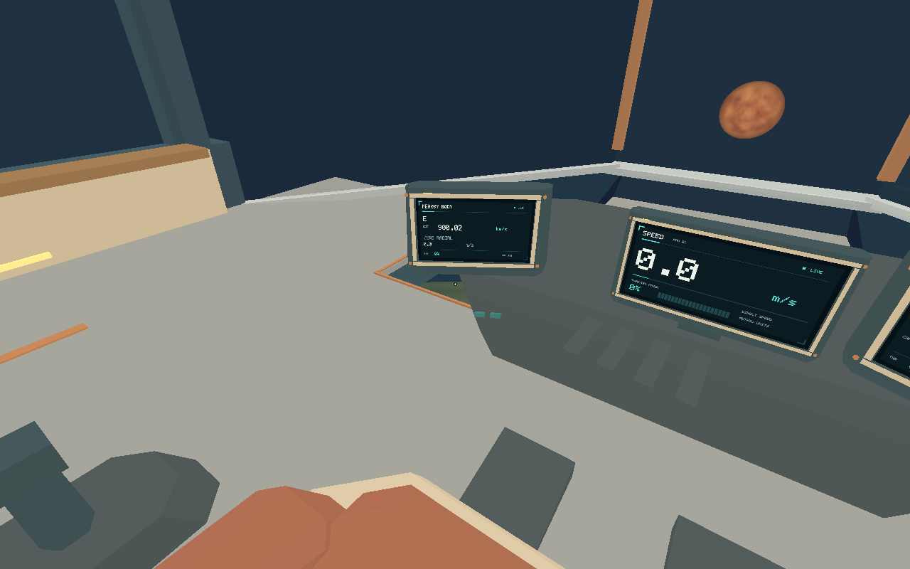

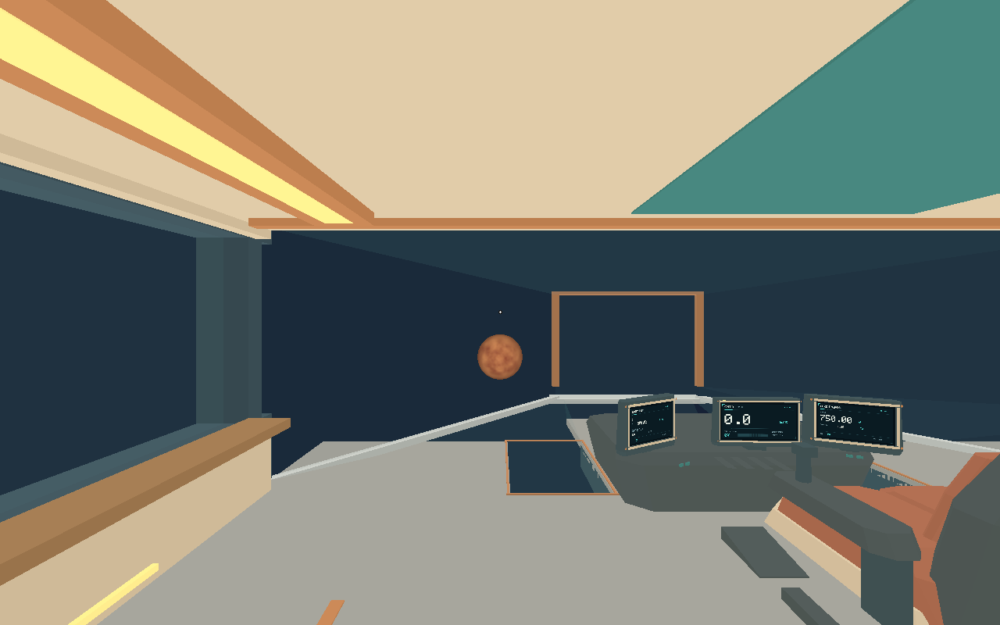
