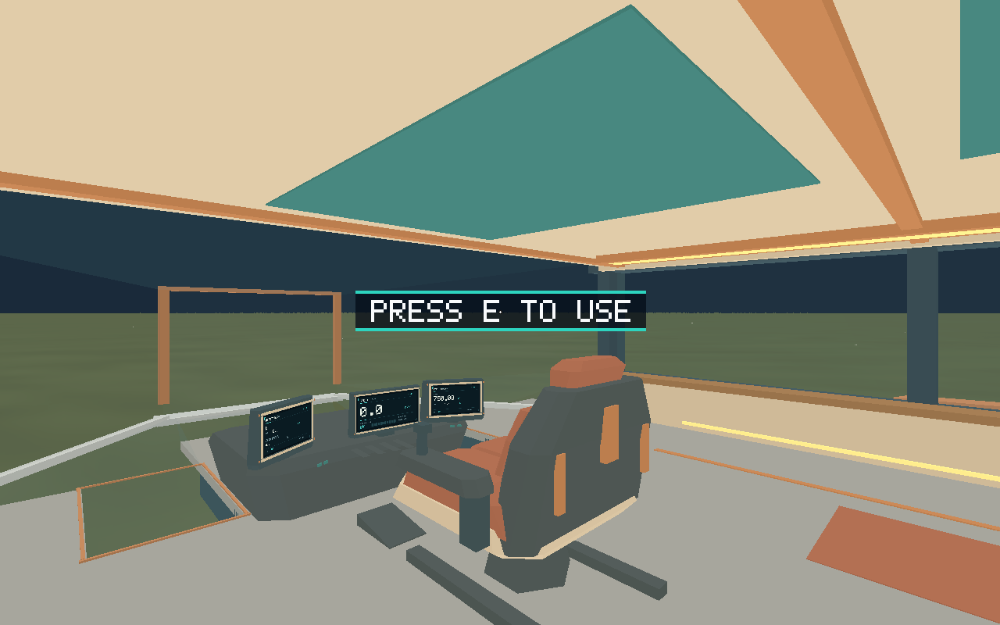
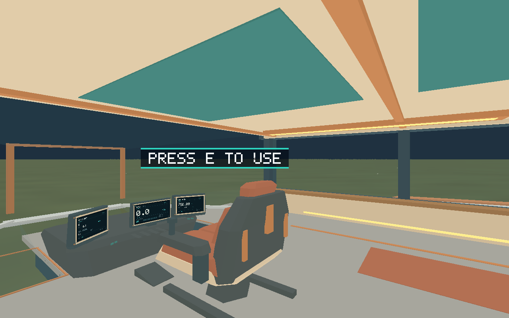
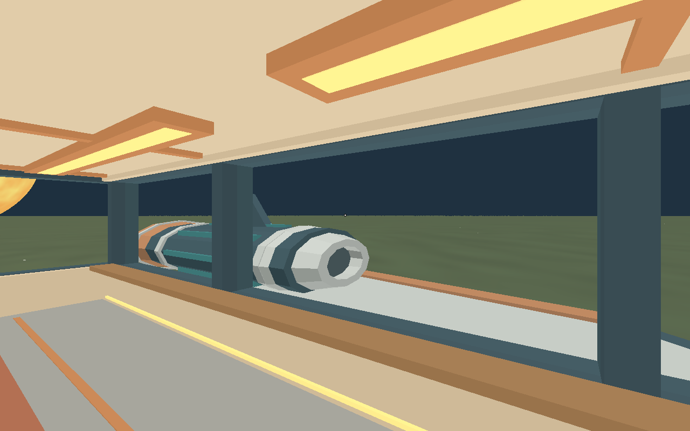
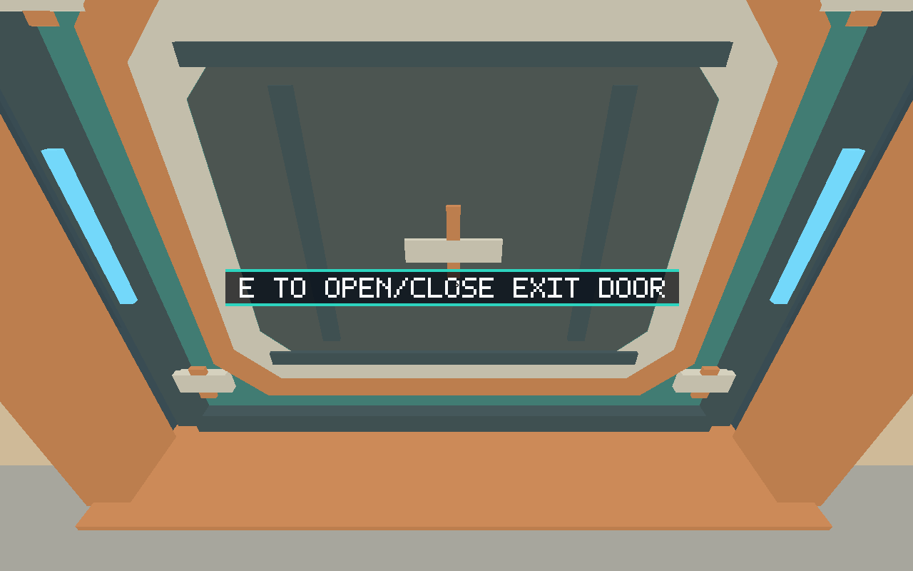
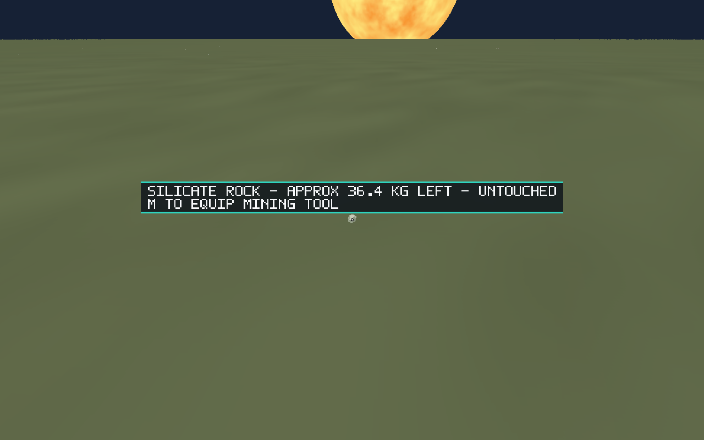
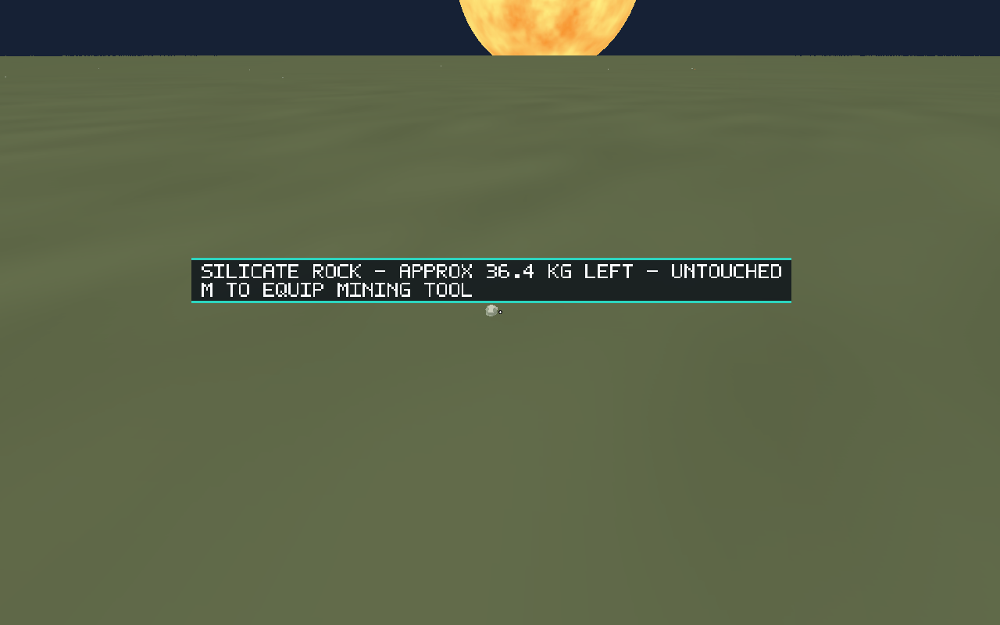
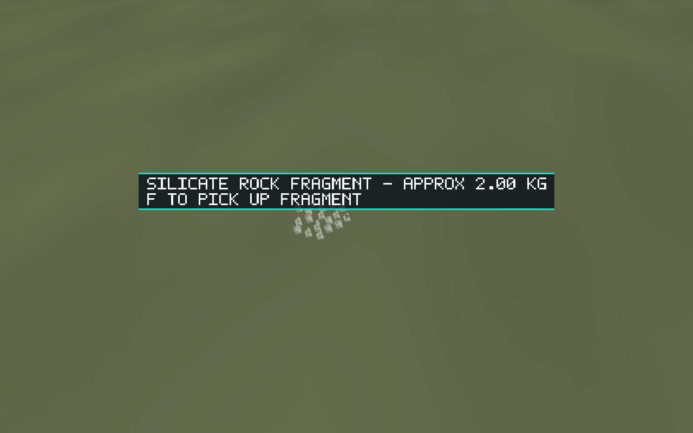
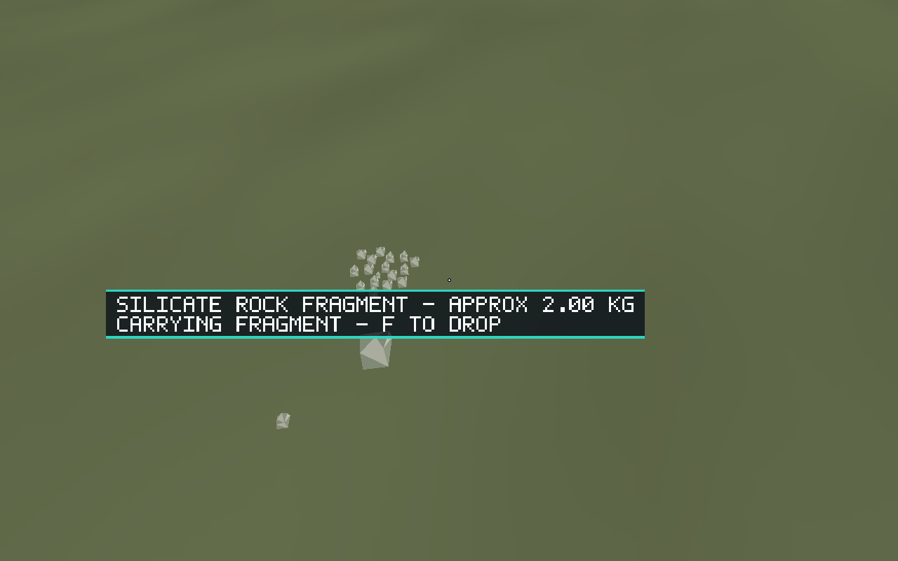

# Issue #127 — World-anchored interaction prompts

Implemented on 2026-10-07 from main `c26406a7533b9c4eb8be31b0d56f0fbe06abb0ed`.

## Outcome

Cockpit, exit-door, deposit and fragment prompts now follow their world objects.
Runtime retains eligibility, priority, text and expiry; renderer owns projection,
viewport fitting and scene-depth visibility. Authored ship markers/current ship
frames and authoritative resource poses supply absolute `f64` anchors. The door
self-visibility bound derives from its authored collider. Carried drop guidance
follows the carried object even when another fragment is targeted.

The same borrowed RGBA image path caches unchanged text. World labels render
12 pixels above their projected anchor, limited to 60% of drawable width, and
hide when behind the camera, outside the viewport, non-fitting or behind closer
opaque geometry. Stored reverse-Z depth is sampled in a separate overlay pass;
the GPU timing interval still spans both passes. Flight/tool guidance and
three-second transient feedback remain screen-space. Guides, invariants, controls,
maintenance routing and automation anchor inspection were updated.

## Validation

Environment: Ubuntu 24.04, Rust 1.99.0, Python 3.12, wgpu 30.0.1,
Mesa lavapipe 25.2.8, Xvfb at 1280×800; native debug executable.

Passed:

```sh
cargo fmt --all -- --check
cargo test --workspace --locked
cargo clippy --workspace --all-targets --locked -- -D warnings
cargo build --workspace --locked
python -m unittest discover -s scripts -p 'test_*.py'
git diff --check
```

271 Rust tests and 34 script tests passed. New regressions cover projection at
1e12-metre origins, moving camera/anchors, invalid/behind/near-clipped/off-screen
anchors, authored-marker transforms and deposit/targeted/carried fragment poses.

Native commands passed with `DISPLAY=127.0.0.1:90`, `WGPU_BACKEND=vulkan` and
`VK_DRIVER_FILES=/tmp/salimon-native/usr/share/vulkan/icd.d/lvp_icd.json`.
Xvfb ran with `:90 -screen 0 1280x800x24 -listen tcp -nolisten unix -nolisten local -ac`;
extracted native tools/libraries were supplied through PATH/LD_LIBRARY_PATH.
TCP was needed because this environment restricts Unix sockets.

```sh
python scripts/salimon-test suite --binary target/debug/salimon-client
python scripts/salimon-test run scenarios/evidence/world-prompts.json --binary target/debug/salimon-client --screenshot-command '["python", "scripts/capture_settled.py", "{path}"]'
python scripts/salimon-test run scenarios/evidence/carrying.json --binary target/debug/salimon-client --screenshot-command '["python", "scripts/capture_settled.py", "{path}"]'
python scripts/salimon-test run scenarios/evidence/mining-tool.json --binary target/debug/salimon-client --screenshot-command '["python", "scripts/capture_settled.py", "{path}"]'
python scripts/packaged_smoke.py --binary target/debug/salimon-client --timeout 90
```

All 13 baseline scenarios passed, plus the three screenshot scenarios and OS-input
smoke. The final carrying checkpoint waits for transient expiry before capturing
the actual carried-object prompt. [Structured evidence](evidence.json) preserves
selected camera, interaction and resource-anchor states and test outcomes.

## Visual evidence










## Limits

Visibility compares one projected anchor against the conservative camera-facing
object bound, not every mesh triangle or label pixel. Transparent cockpit glass
does not occlude labels because it does not write depth. Labels whose complete
rectangle cannot fit are hidden rather than moved to an unrelated edge.

Native evidence uses software Vulkan/debug builds. Release staging, macOS/Windows
hardware checks and reference Apple M1 performance were not run here. No assets,
build tooling, domain eligibility or input controls changed. The issue remains
open for PR review and closure on merge.
