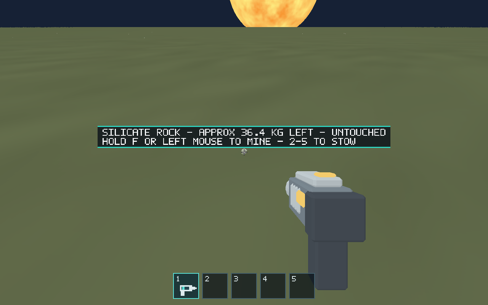
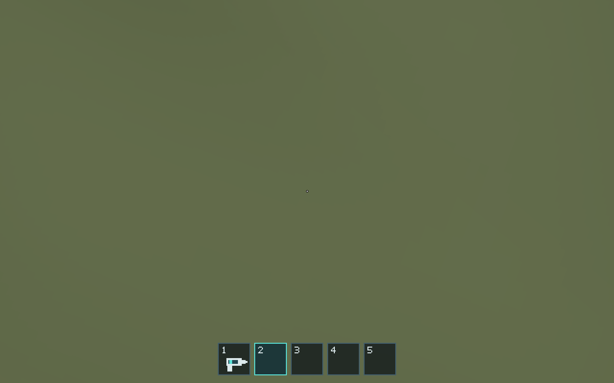

# Issue #130 — Toolbar-driven mining equipment

Implemented on 2026-10-07 against main `ada9e9b`. Toolbar state/input (#128)
and HUD (#129) were already merged, resolving the issue's prerequisites.

## Outcome

Slot 1 is the sole mining-tool equipment decision. Empty slots 2–5 or absent
selection stow it. `MiningTool` no longer stores an equipped boolean: targeting,
extraction, held mesh, reticle, resource prompts and automation inspection all
consume `EquipmentToolbar::mining_equipped()`.

Switching slots immediately cancels both keyboard and mouse mining. Selecting
slot 1 again requires a fresh mining press. Successful pickup clears selection
and both mining sources while preserving the consumed F latch; dropping does
not restore equipment. Existing surface/range/obstruction and contextual F
carrying priority remain unchanged.

Removed the normal M binding and the legacy `equip_mining_tool` automation
command. All affected baseline/evidence scenarios now explicitly select slots;
controls, runtime contracts, maintenance map and runner guidance are updated.
Regressions cover all four empty slots, cancellation/non-resumption, held mesh,
reticle and target agreement, pickup while mouse mining, carry lockout and M
rejection. Existing mining/transfer/streaming walkthroughs retain their coverage.

## Validation

Ubuntu 24.04, Rust/Cargo 1.99.0, Python 3.12.14; graphical checks use Mesa
lavapipe software Vulkan at 1280×800 with Xvfb over local TCP.

| Command | Result |
| --- | --- |
| `cargo fmt --all -- --check` | Passed |
| `cargo clippy --workspace --all-targets --locked -- -D warnings` | Passed |
| `cargo test --workspace --locked` | Passed; 281 tests, one existing ignored GPU test |
| `cargo build --workspace --locked` | Passed |
| `cargo build --release --locked -p salimon-client` | Passed |
| `python -m unittest discover -s scripts -p 'test_*.py'` | Passed; 34 tests |
| `python scripts/salimon-test suite --group resource-collection --binary target/release/salimon-client --artifacts artifacts/issue-130-baseline` | Passed; all six native scenarios |
| `python scripts/salimon-test run scenarios/evidence/mining-tool.json --binary target/release/salimon-client --artifacts artifacts/issue-130 --screenshot-command '["python", "scripts/capture_settled.py", "{path}"]'` | Passed; 161 steps, captured checkpoints |
| `git diff --check` | Passed |

The graphical commands ran with `DISPLAY=127.0.0.1:77.0`, `WGPU_BACKEND=vulkan`,
`VK_DRIVER_FILES` pointing to the downloaded Mesa `lvp_icd.json`, and local
native binaries/libraries on PATH/LD_LIBRARY_PATH. Initial setup attempts failed
before ready because the X server lacked xkbcomp; installing its executable
and using local TCP resolved the setup issue. Final runs above passed.

[Structured validation summary](validation.json).

Slot 1 selected: held tool and cross reticle agree with the toolbar highlight.

Slot 2 selected: no held tool, dot reticle and empty-slot highlight.

## Limits

No authored assets or renderer internals changed. Blender/model validation was
not applicable. Software Vulkan checks establish gameplay/capture behavior,
not macOS/Windows hardware appearance or performance. Reference-machine
performance and packaged OS input smoke were not run. GitHub CI provides the
cross-platform gates after the PR is opened; this report records local results.
