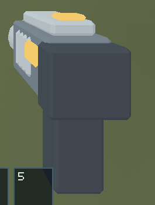
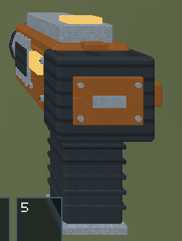
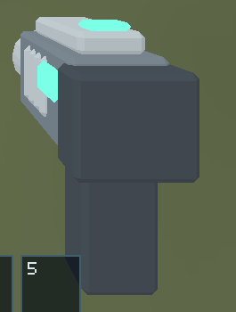
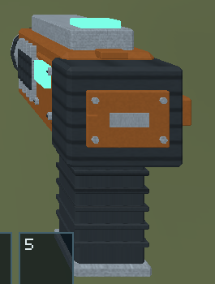

# Issue #142 — mining-tool detail, surfaces and toolbar alignment

Implemented on top of `758894697c02ecf128a86f1a6835c9b8b341579d` (2026-10-09).
The source/export, renderer and toolbar now agree on the richer manufactured
extractor. Gameplay input, reach, mining rates, carrying policy, slot selection,
reticle and camera-local grip transform are unchanged.

## Changes

- Editable Blender source adds housing/battery panel seams and fasteners, vents,
  ribbed grip, trigger/guard, battery contacts/latch and emitter assembly details.
  Original generated surface imagery separates coated orange polymer, dark rubber,
  brushed steel and amber/teal status. No third-party textures or attribution obligations.
- GLB embeds one 256×256 opaque PNG and baked material-specific UVs. Renderer
  decodes it once, uploads an sRGB mip chain and samples it in the actual held-tool
  fragment shader. Authored metallic/roughness factors control material highlights.
  Unsupported maps/material contracts fail loading instead of being silently ignored.
- The transparent icon is rendered from the saved Blender source. Visible alpha
  bounds determine fitting/centering, including asymmetric canvas padding. Four
  logical pixels of padding protect the border, and number glyphs remain legible.
  The regression checks layout and the final composite at every raster density.
- Shared validation now checks image/texture/sampler references and UV accessors
  for textured primitives. Asset-specific regression verifies atlas dimensions,
  every material's UV tile, identity transforms and the checked-in export budgets.
- Updated [asset contract](../../models/assets/items/mining-tool/README.md),
  renderer architecture/invariants and shared model contracts.

| Export metric | Before | After | Budget |
| --- | ---: | ---: | ---: |
| Triangles | 640 | 2,096 | 3,000 |
| Primitives | 12 | 15 | 16 |
| Materials | 4 | 4 | 4 |
| Embedded texture bytes | 0 | 68,079 | 98,304 |
| GLB bytes | 53,044 | 226,380 | 393,216 |

One held-item scene draw remains. Atlas GPU memory is 349,524 bytes including
nine mips; the original 128×128 toolbar PNG decodes to 64 KiB. No per-frame
atlas regeneration or upload. See the asset contract for axes/bounds and regeneration.

## Reviewed native before/after evidence

These are actual Linux winit/wgpu Vulkan screenshots. Both revisions use the
same deterministic `mining-tool.json` scenario and normal camera placement at
1280×800. Detail images are unscaled crops from the full captures, not DCC renders.
Reviewed: panel fasteners and label, grip ribs, surface grain/brushed metal, clear
idle amber/active teal, centered toolbar art and legible numbers/borders.

| State | Before | After |
| --- | --- | --- |
| Normal held tool, idle | [Full capture](before-held-idle.png) | [Full capture](after-held-idle.png) |
| Normal held tool, active | [Full capture](before-held-active.png) | [Full capture](after-held-active.png) |
| Idle detail |  |  |
| Active detail |  |  |

Extreme camera checks: [up](after-look-up.png), [up plus yaw](after-look-up-yaw.png),
[down](after-look-down.png). The grip stays at the same screen position and the
center aim stays separate. Up/yaw screenshots have the same empty-sky background;
the scenario records the intervening yaw action.

Toolbar captures resize the same live window before capture; subsequent states
retain that viewport. `WINIT_X11_SCALE_FACTOR` explicitly sets the tested density.
Slot 2 selection leaves the slot 1 icon visible and unselected, with empty slots intact.

| DPI / physical viewport | Slot 1 selected | Slot 1 unselected (slot 2 selected) |
| --- | --- | --- |
| 1x / 640×480 | [Selected](toolbar-1x-640x480-selected.png) | [Unselected](toolbar-1x-640x480-unselected.png) |
| 1.5x / 960×640 | [Selected](toolbar-1.5x-960x640-selected.png) | [Unselected](toolbar-1.5x-960x640-unselected.png) |
| 2x / 1920×1080 | [Selected](toolbar-2x-1920x1080-selected.png) | [Unselected](toolbar-2x-1920x1080-unselected.png) |

Carrying composition: [fragment carried/tool stowed](after-carrying.png),
[dropped with toolbar still deselected](after-dropped.png),
[explicit slot 1 reselection/tool restored](after-reselected.png).
[Native results](native-results.json) preserve run status, assertion counts and
relevant equipment/mining/carrying state at captures, without full world dumps.

## Validation

Environment: Ubuntu 24.04 x86_64, Rust 1.99.0 stable with rustfmt/Clippy,
Python 3.12.14, Blender 4.5.3 LTS, Mesa lavapipe 25.2.8, Xvfb. Native checks used
the debug executable (not a staged release or hardware performance benchmark).

| Command/check | Result |
| --- | --- |
| `python models/tools/export_asset.py item.mining-tool --blender /tmp/blender-4.5.3-linux-x64/blender` | Passed; checked-in runtime regenerated from source |
| `/tmp/blender-4.5.3-linux-x64/blender --background models/assets/items/mining-tool/source.blend --python-exit-code 1 --python models/assets/items/mining-tool/render_icon.py` | Passed; icon regenerated from saved source |
| `python models/tools/validate_asset.py item.mining-tool` | Passed; metrics above |
| `BLENDER=/tmp/blender-4.5.3-linux-x64/blender python -m unittest discover -s models/tests -v` | Passed, 55 tests including real Blender export |
| `cargo fmt --all -- --check` | Passed |
| `cargo clippy --workspace --all-targets --locked -- -D warnings` | Passed |
| `cargo test --workspace --locked` | Passed, 283 tests; one existing opt-in resource GPU test ignored |
| `cargo test -p salimon-renderer --locked` after final placement regression | Passed, 49 tests; same existing opt-in GPU test ignored |
| `cargo build --workspace --locked` | Passed |
| `python -m unittest discover -s scripts -p 'test_*.py'` | Passed, 34 tests |
| `python scripts/salimon-test suite --binary target/debug/salimon-client --artifacts artifacts/issue-142/baseline --screenshot-command '[]'` | Passed, all 13 baseline scenarios |
| Native `mining-tool.json` evidence, before and after | Passed, 161 steps each; status/mining/aim and extreme look checks |
| Native `carrying.json` evidence | Passed, 320 steps; empty-slot mining rejection, F pickup/drop, one-object lockout and reselection |
| Native `equipment-toolbar.json` evidence at 1x/1.5x/2x | Passed, 14 steps per density, selected/unselected/empty-slot states |
| `python scripts/packaged_smoke.py --binary target/debug/salimon-client --timeout 90` | Passed; real X11 F2 round trip and gameplay liveness |
| PNG chunk CRC/IEND integrity and complete Pillow decode of committed screenshots | Passed; incomplete initial captures rejected/replaced |
| `git diff --check` and report link existence | Passed |

Native commands ran on a dedicated Xvfb display in the same shell/process namespace
as their game/capture children. Unix X11 sockets are unavailable in this execution
environment, so use TCP X11 with `Xvfb :99 -nolisten unix -listen tcp -ac -screen 0
1920x1080x24`, `DISPLAY=127.0.0.1:99`, `WGPU_BACKEND=vulkan`, and
`VK_DRIVER_FILES=/usr/share/vulkan/icd.d/lvp_icd.json`. Stop that dedicated server
after the commands. This avoids claiming failed initial Unix-socket launches as coverage.

Exact evidence runner (use `carrying.json` or `equipment-toolbar.json` as applicable):

```sh
SALIMON_CAPTURE_SIZE=1280x800 WINIT_X11_SCALE_FACTOR=1 \
python scripts/salimon-test run scenarios/evidence/mining-tool.json \
  --binary target/debug/salimon-client --artifacts artifacts/issue-142/final-evidence \
  --screenshot-command '["python", "reports/issue-142/capture_resized.py", "{path}"]'
```

Toolbar variants set `SALIMON_CAPTURE_SIZE=640x480`, `960x640`, `1920x1080` and
`WINIT_X11_SCALE_FACTOR=1`, `1.5`, `2` respectively. The report-local helper resizes
the sole Salimon window, waits for presentation, captures just that window, and
checks PNG completeness/CRC (up to three attempts, then fails). Before evidence
used an isolated worktree/binary at the base revision above.

## Limits

Linux software Vulkan proves these rendering/state/capture paths, not native
macOS Metal/Windows fidelity or Apple M1 performance. Those hardware checks and
release staging were not run locally; CI retains its three-platform build gates.
The shading is intentionally compact camera-local fill/highlights, without
world PBR/IBL, normal maps, dynamic shadows or animation. No remaining implementation
blockers identified for this issue; the PR is left for review/merge.
