# Issue #144 — resource gameplay size

Implemented against main `2af99bb2af27801ef3ee8da84f78f78e9d1538c3` on 2026-10-09.
The review branch enlarges every deposit/fragment variant by **10× on each axis**
without changing mass, density-derived solid volume, mining rate, yield or the
single-object carrying rule. Native resource evidence passes on Linux software Vulkan, and before/after
gameplay screenshots are included below. A separate measured comparison renders
the actual exported vertices.

## Changes

- World `resource_size` is the shared geometry authority. A 2 kg fragment's
  gameplay cube side is approximately 0.830 m iron, 0.905 m silicate, 1.295 m ice.
  Material volume is still mass / density; bounding volume grows by 1,000×.
- Deposits retain initial geometry through partial mining and disappear at
  depletion. Runtime places their authored lower support 5 mm above terrain;
  the same center feeds the mesh, targeting and object prompt. Seed arithmetic,
  IDs, variant selection and generation query membership remain unchanged.
- Growing fragments use current mass; pickup still seals growth. Spawn lanes
  reserve full size and wider spacing. Physics receives a circumscribed cube
  sphere for pair/hull clearance and separate actual mesh support for ground/deck
  contact. Pair response remains an approximate sphere solver, without spinning.
- Carrying keeps the full cube ahead of the player's vertical capsule at every
  pitch and clamps its lower support above the floor/terrain. Invalid ship floor
  drops preserve the carried object. F input/equipment exclusivity is unchanged.
- Production-control baseline/evidence routes were recalibrated for larger
  fragment spawn positions, pickup aim, carrying clearance and cargo positions.
  Surface extraction, depletion, streaming, F exclusivity and cargo round trips
  remain protected by runtime walkthrough tests.

## Measured authored geometry

[All 18 before/after measurements](measurements.json) use every GLB POSITION
vertex with baked identity transforms. Fragment mass is 2 kg; deposit mass is
30 kg. Axes are world X/Y/Z. Every axis of every variant has exactly a 10×
visible extent ratio, independent of nominal cube/sphere bounds.

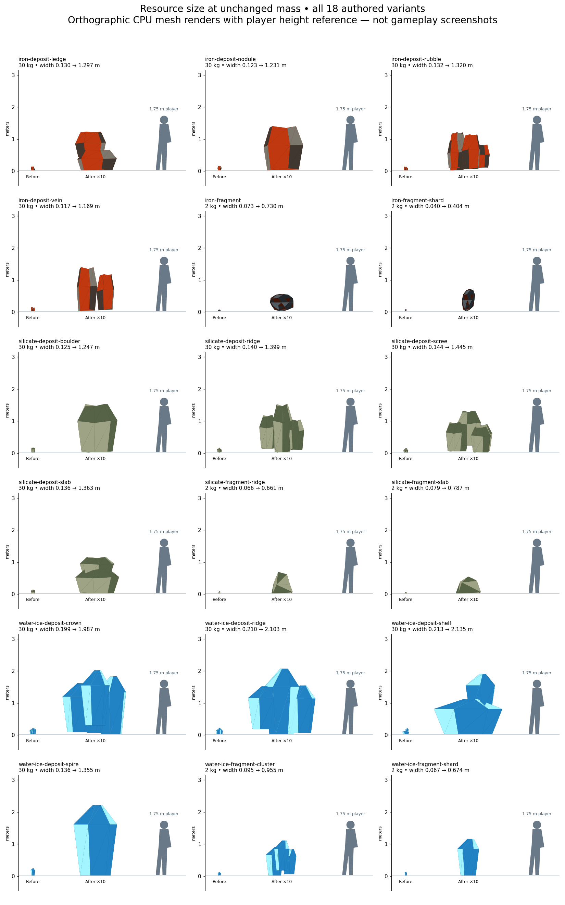

This is an orthographic CPU mesh render, **not a native gameplay screenshot**.
Meshes are shown entirely above a comparison ground line; original deposits in
production were partly buried, so the visible in-game increase can exceed 10×.

| Variant | Mass (kg) | Before X/Y/Z (m) | After X/Y/Z (m) |
| --- | ---: | --- | --- |
| iron-deposit-ledge | 30 | 0.130/0.121/0.112 | 1.297/1.212/1.117 |
| iron-deposit-nodule | 30 | 0.123/0.138/0.100 | 1.231/1.382/0.996 |
| iron-deposit-rubble | 30 | 0.132/0.119/0.115 | 1.320/1.189/1.152 |
| iron-deposit-vein | 30 | 0.117/0.138/0.101 | 1.169/1.382/1.009 |
| iron-fragment | 2 | 0.073/0.055/0.058 | 0.730/0.548/0.584 |
| iron-fragment-shard | 2 | 0.040/0.070/0.043 | 0.404/0.701/0.426 |
| silicate-deposit-boulder | 30 | 0.125/0.151/0.105 | 1.247/1.507/1.047 |
| silicate-deposit-ridge | 30 | 0.140/0.151/0.091 | 1.399/1.507/0.915 |
| silicate-deposit-scree | 30 | 0.144/0.130/0.127 | 1.445/1.297/1.265 |
| silicate-deposit-slab | 30 | 0.136/0.113/0.111 | 1.363/1.132/1.114 |
| silicate-fragment-ridge | 2 | 0.066/0.067/0.054 | 0.661/0.670/0.543 |
| silicate-fragment-slab | 2 | 0.079/0.052/0.062 | 0.787/0.525/0.615 |
| water-ice-deposit-crown | 30 | 0.199/0.200/0.195 | 1.987/2.002/1.955 |
| water-ice-deposit-ridge | 30 | 0.210/0.205/0.095 | 2.103/2.050/0.950 |
| water-ice-deposit-shelf | 30 | 0.213/0.188/0.196 | 2.135/1.883/1.956 |
| water-ice-deposit-spire | 30 | 0.136/0.219/0.131 | 1.355/2.193/1.311 |
| water-ice-fragment-cluster | 2 | 0.095/0.109/0.084 | 0.955/1.088/0.836 |
| water-ice-fragment-shard | 2 | 0.067/0.114/0.058 | 0.674/1.140/0.583 |

## Validation

Environment: Linux x86_64, Rust/Cargo 1.99.0, Python 3.12.14, software Vulkan
lavapipe. All commands ran from the repository root with locked dependencies.

| Command | Result |
| --- | --- |
| `cargo fmt --all -- --check` | Passed |
| `cargo clippy --workspace --all-targets --locked -- -D warnings` | Passed |
| `cargo test --workspace --locked` | Passed: 288 tests; one GPU test ignored in the default suite |
| `cargo build --workspace --locked` | Passed |
| `python3 -m unittest discover -s scripts -p 'test_*.py'` | Passed: 34 tests |
| `WGPU_BACKEND=vulkan VK_DRIVER_FILES=/usr/share/vulkan/icd.d/lvp_icd.json cargo test --locked -p salimon-renderer headless_resource_pipeline -- --ignored` | Passed: resource pipeline initializes and validates on Vulkan without a window |
| `cargo test --locked -p salimon-client terrain_support_and_default_spacing -- --nocapture` | Passed: actual terrain support and deterministic restoration; proximity audit below |
| `git diff --check` | Passed |

Focused regressions include all three materials at small/growing/full mass,
all 18 scaled authored extents, axis/diagonal terrain support, partial/depleted
state, permanent one-object carrying, extreme up/down pitch, safe/unsafe cargo
drops and separate physical ground support versus pair radius. Runtime
walkthroughs exercise actual movement, mining, pickup/drop and streaming controls.
No assets or generated exports changed, so Blender regeneration was not needed.

The implementation commit `c23e7229a89585e4355feb301ef6a9b8bb6f3c51` passed
[CI run 37906362267](https://github.com/mr-exception/salimon/actions/runs/37906362267)
on Linux, macOS and Windows, including Linux native baseline/evidence and
packaged OS-input smoke. Screenshot/report follow-up changes no gameplay code.

## Spacing audit and limitations

At seed 0, 120 m queries on +Y, +Z and the positive cube seam sampled 1,695
deposits across the five solid bodies. The actual authored AABB audit found
four possible overlapping pairs: two among 273 Earth seam deposits and two
among 184 Mars seam deposits; all other sampled areas had zero. AABB overlap
is conservative and does not establish triangle intersection. Existing seeded
positions/IDs and all mass are retained; this change does not silently remove
neighbors or change the world seed by altering profile spacing. See
[spacing audit log](spacing-audit.log). This is sampled coverage, not a global
non-overlap guarantee. A separate spacing policy would need an explicit decision
about moving existing deposits while preserving stable identities.

## Native before/after evidence

The X-server connection issue was resolved by launching TCP-only Xvfb and all
clients **inside the same execution session/network namespace**. The original
binary was captured with original scenarios from base `2af99bb`; the updated
binary uses the revised production-control scenarios. Both run at 1280×800.
The original mining/carrying/resource-loop routes all passed. All six updated
resource-collection evidence routes passed (1,192 steps total). See
[native results](native-results.json). Screenshots were visually inspected.

```sh
# Keep server and clients in the same execution session. UNIX sockets are unavailable.
Xvfb :90 -screen 0 1280x800x24 -nolisten unix -nolisten local -listen tcp -ac &
export DISPLAY=127.0.0.1:90 WGPU_BACKEND=vulkan
export VK_DRIVER_FILES=/usr/share/vulkan/icd.d/lvp_icd.json
python3 scripts/salimon-test suite --group resource-collection --evidence \
  --binary target/debug/salimon-client --artifacts artifacts/issue144/after-native \
  --screenshot-command '["python3","scripts/capture_settled.py","{path}"]'
```

Additional ice and iron runs walk to actual seed-0 deposits, aim, mine, target
and carry through the production protocol. No teleport, resource insertion,
mass edit or test-only extraction was used. Small/growing/full output masses
are 0.032 / 0.992 / 2.000 kg; total extracted mass after 63 frames is 2.016 kg
(the extra 0.016 kg starts the next piece). Before/after mass values match.
Their exact replay controls and concise states are retained beside this report.

| Replay | Before | After |
| --- | --- | --- |
| Ice | [Controls](before-ice-evidence.json), [states](before-ice-state.json) | [Controls](after-ice-evidence.json), [states](after-ice-state.json) |
| Iron | [Controls](before-iron-evidence.json), [states](before-iron-state.json) | [Controls](after-iron-evidence.json), [states](after-iron-state.json) |

These JSON controls can be rerun with `scripts/salimon-test run <path> --binary
<matching binary> --screenshot-command '["python3","scripts/capture_settled.py","{path}"]'`.
Use the original binary for before controls. Scripted inspection/snapshots make
state assertions explicit in the baseline suites; these extra visual replays
contain the controls/checkpoints, with the captured state as supporting evidence.

The following pairs retain the same resource mass. Pickup cameras are adapted
to changed fragment spawn/hand positions, so pixel ratios are not dimensional
measurements; the vertex measurements above establish the exact 10× ratio.
The authored comparison supplies a 1.75 m player reference, and cargo screenshots
supply the unchanged ship-floor/trim reference.

| Scene | Before | After |
| --- | --- | --- |
| Silicate deposit, 36.4 kg | 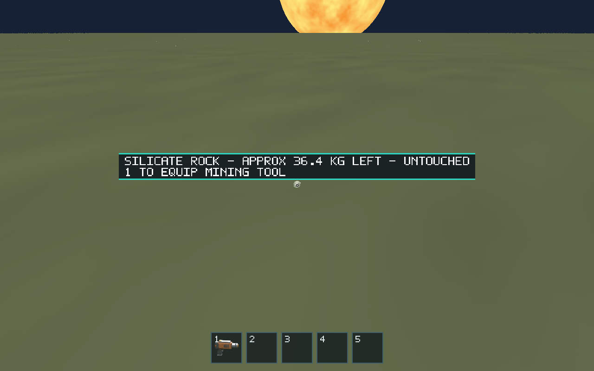 | 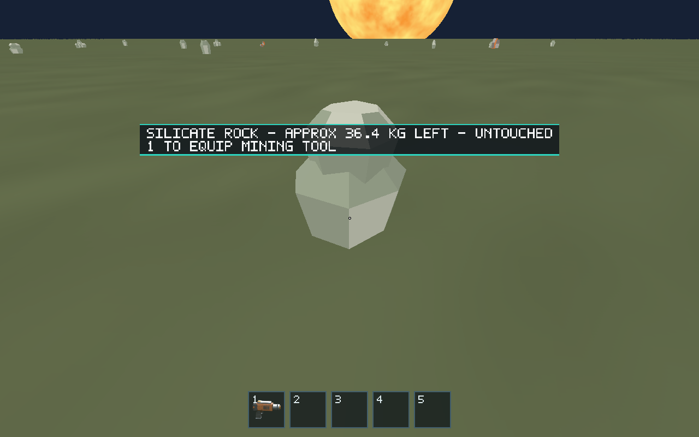 |
| Silicate full fragment, carried | 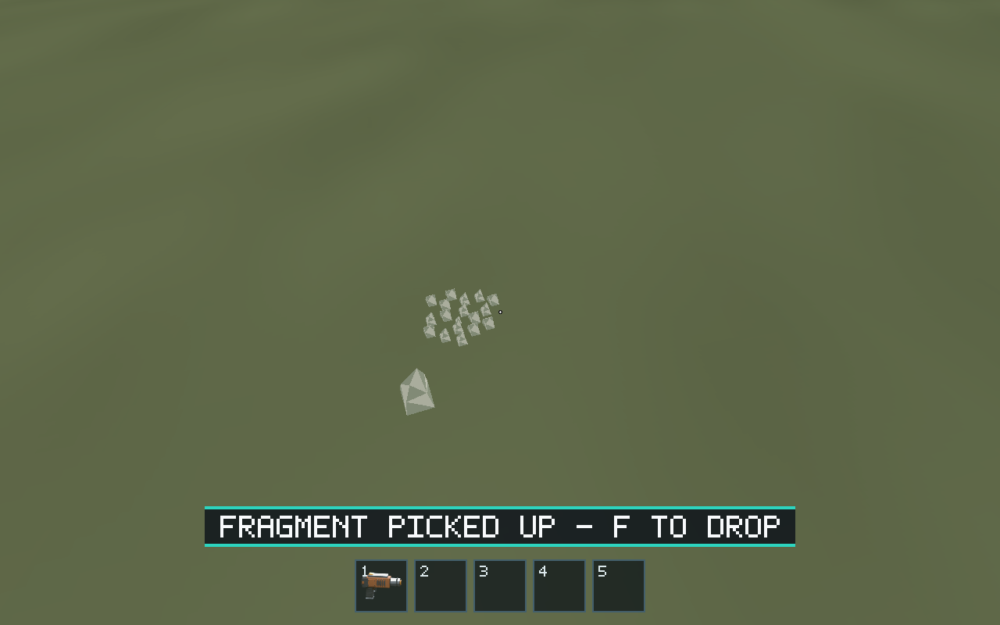 | 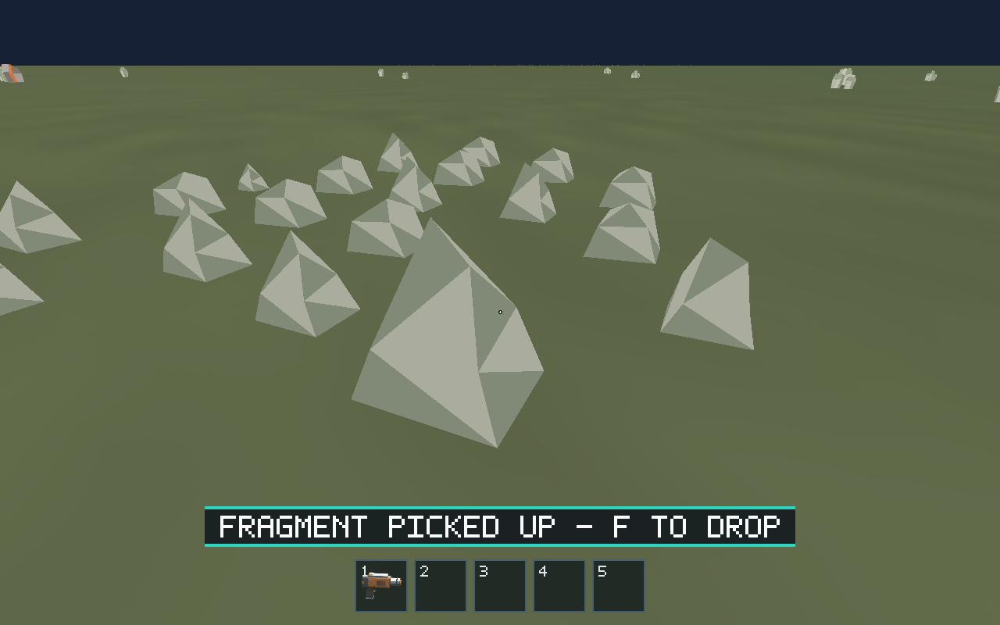 |
| Ship deck, same 2 kg fragment | 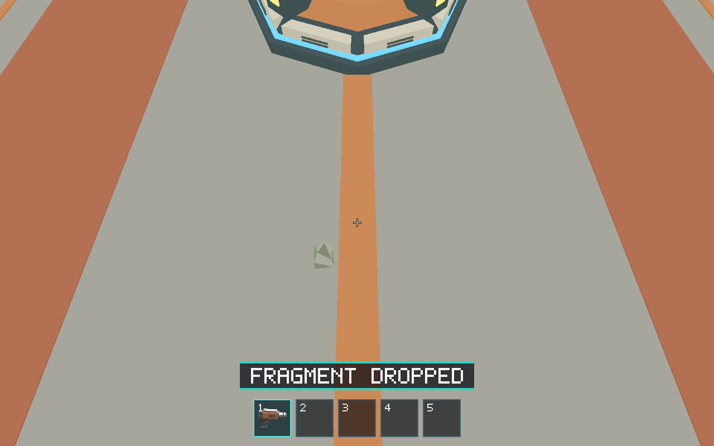 | 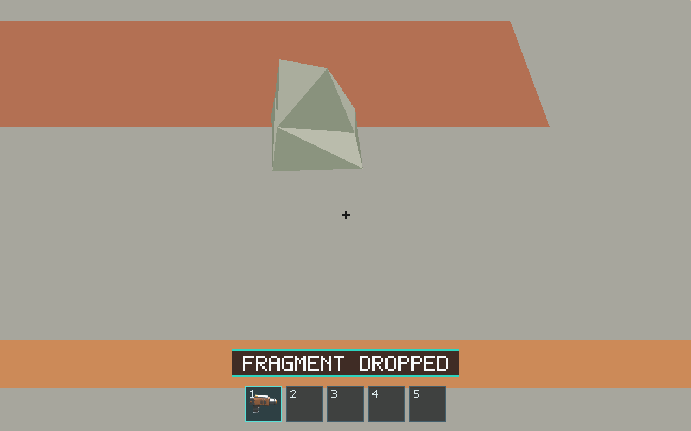 |
| Ice deposit, unchanged mass label | 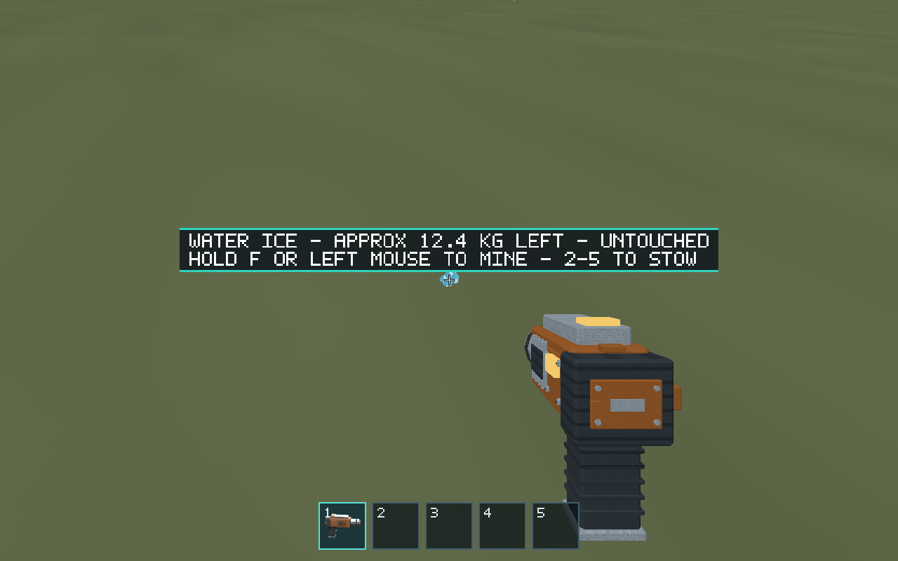 | 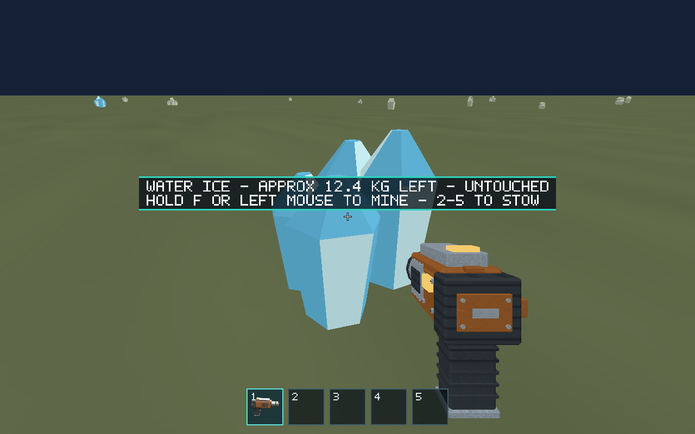 |
| Ice fragment, 2.00 kg | 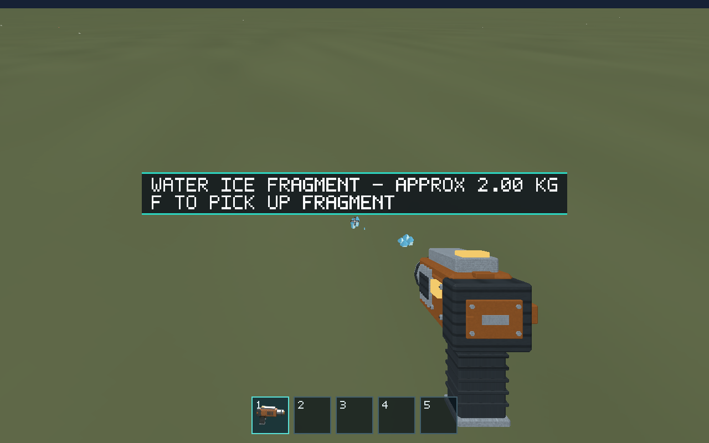 | 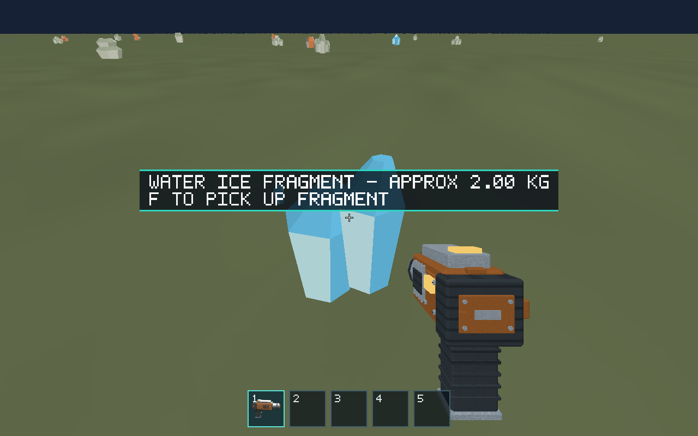 |
| Iron deposit, unchanged mass label | 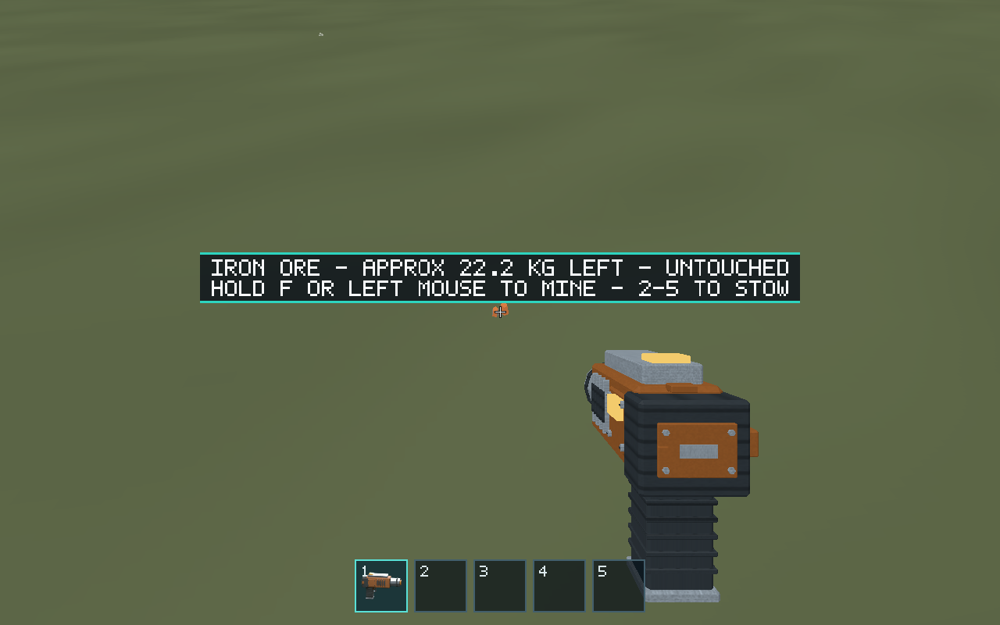 | 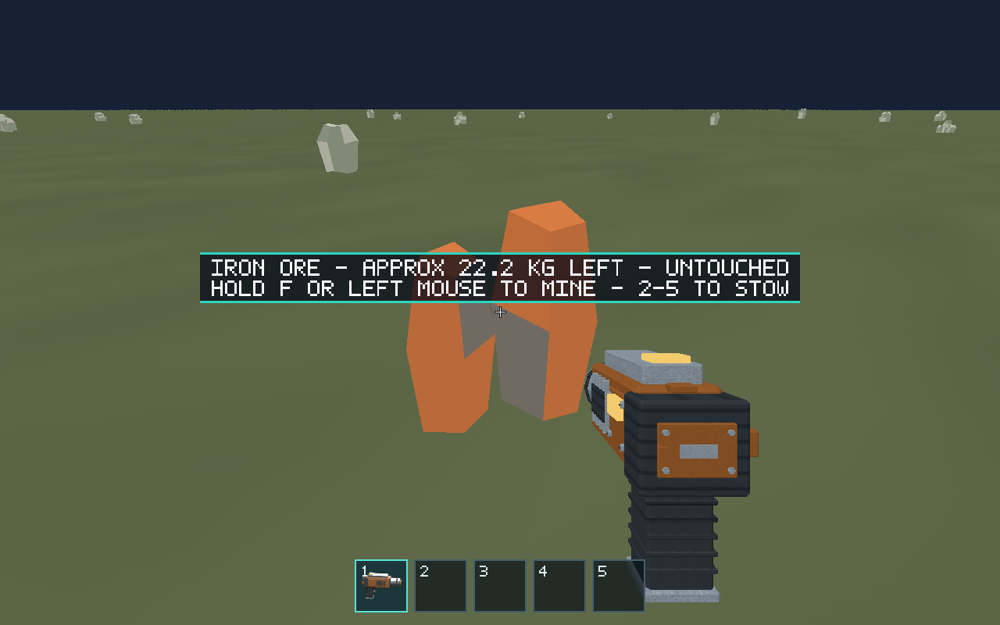 |
| Iron fragment, 2.00 kg | 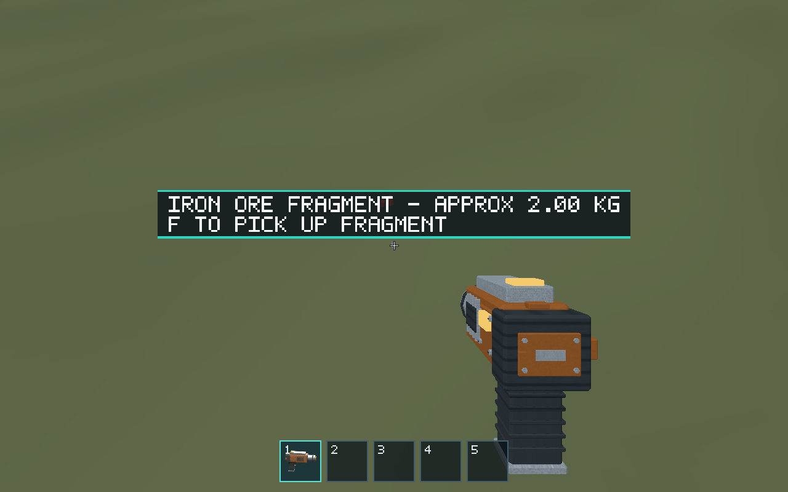 | 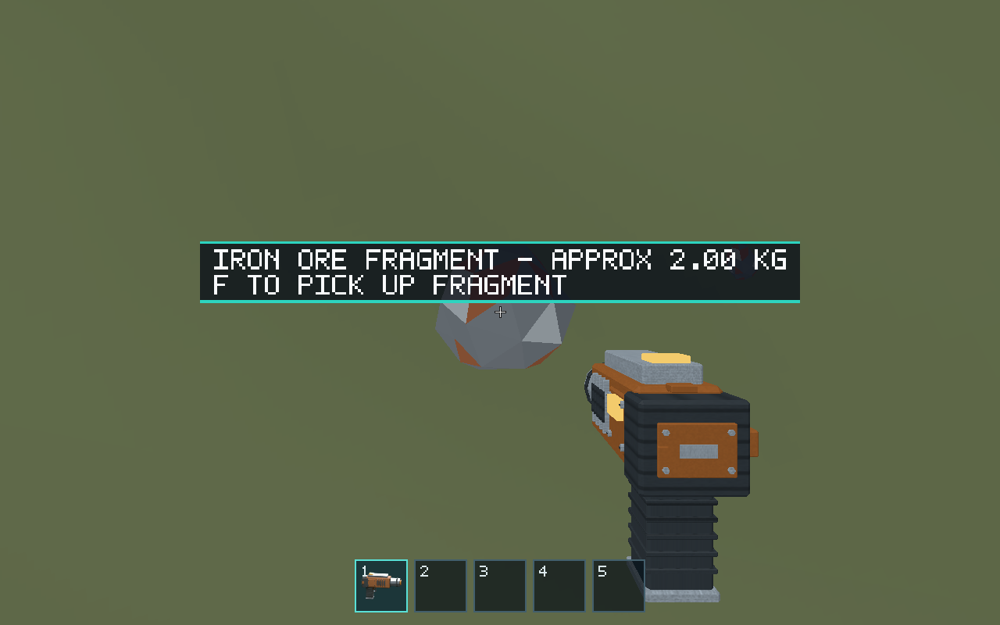 |

Additional checkpoints: [ice small output](after-ice-small-output.png),
[ice growing output](after-ice-growing-output.png), [ice carried](after-ice-carried.png),
[iron small output](after-iron-small-output.png), [iron growing output](after-iron-growing-output.png),
[iron carried](after-iron-carried.png). The controller tests and native suites also
verify partial/depleted deposits and restoration, including the journal tombstone.

Linux software rendering/input evidence does not certify native macOS/Windows
visual fidelity or reference-machine performance; those were not tested locally.
