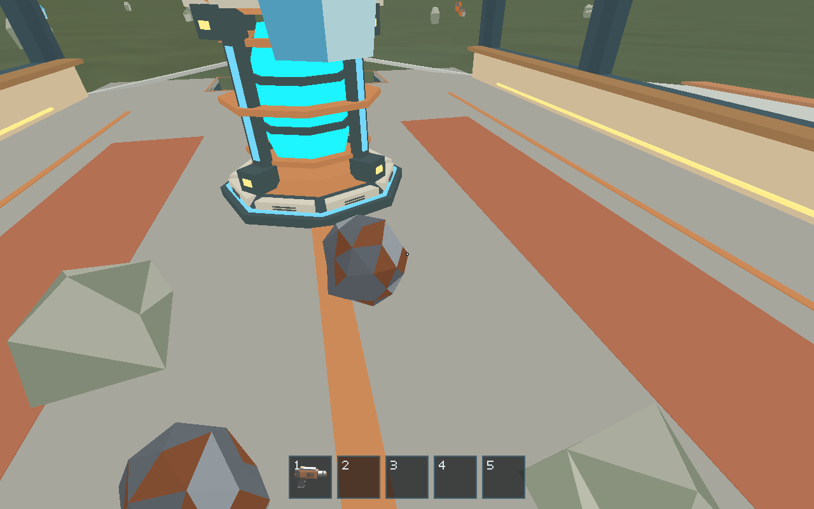
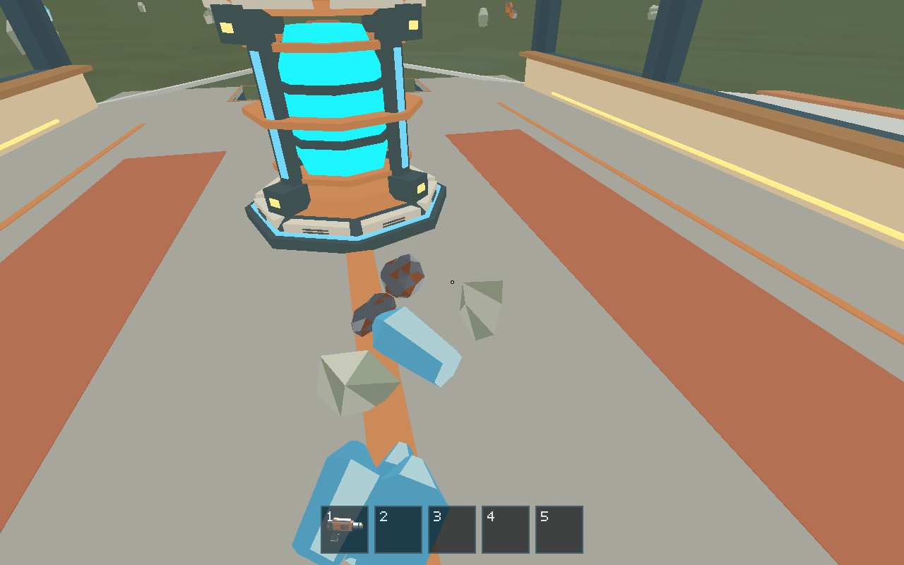
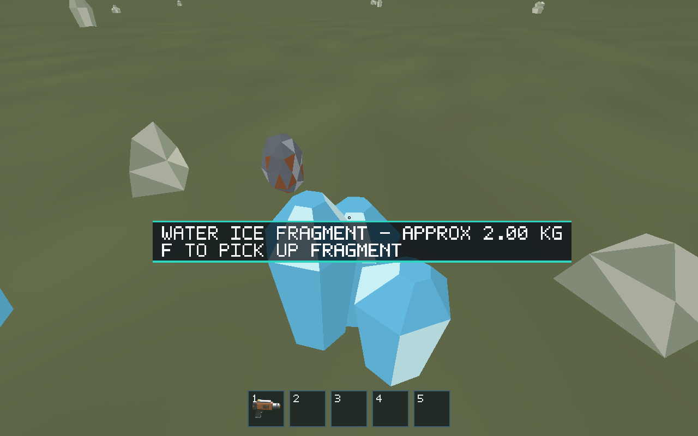
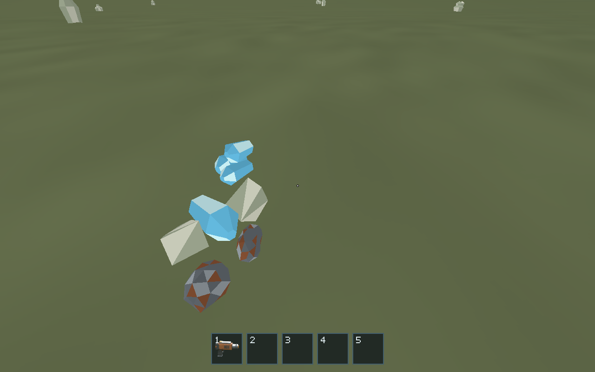

# Issue 148 — fragment geometry and pile contacts

Fragments now use a 5× density-derived linear scale, half the former 10× on
all axes at fixed mass. Deposits retain 10×. Mining yield, fragment identities,
resource types and material volume remain unchanged.

The renderer's immutable authored GLB vertices supply six cached convex hulls.
Separating-axis contacts use face normals and crossed edge directions; spheres
only reject distant pairs and provide conservative player/ship clearance.
Mass-weighted impulses, friction, angular velocity, rotated support features and
adaptive substeps let fragments tip, roll and settle against other fragments,
terrain and the cabin floor. Current mass/scale refresh growing-fragment contact.

World quaternions reach rendering and oriented pickup bounds. Carry/drop retain
the pose, while ship-local position and orientation survive translation and
rotation. Removing a supporting piece restores gravity immediately; there is no
sleep cache retaining an absent support. Existing in-memory streaming behavior
remains intact. No authored assets, mass constants or engine dependencies change.

Gameplay checkpoints aim through normal mouse-look at exposed pickup bounds,
then use the normal F key, range and occlusion rules. Delivery routes restore
their preceding walking heading. Cabin resting-coordinate checks allow 2 cm of
platform-dependent settling variation; focused hull/deck checks retain millimeter
tolerances. Development/test profiles optimize just physics and math while
retaining debug assertions and debug information.

## Reviewed native evidence

Captured with the release native client on Ubuntu 24.04, Mesa software Vulkan,
X11/Xvfb at 1280×800, fixed 16 ms steps. Six 2 kg fragments cover every authored
variant. The same initial fixture and camera were used on base revision
`8cc5066` and implementation revision `8fe59c5`; only the fixture was copied into
the base worktree. [Capture run](https://github.com/mr-exception/salimon/actions/runs/38043741358).
These are unedited native screenshots, including the game's UI.

| Surface | Before, 19.2 s | After, 19.2 s |
| --- | --- | --- |
| Cabin deck |  |  |
| Terrain |  |  |

The base deck capture retains a floating ice fragment, 1.54 m above its authored
lower support. The new fragments have visibly different settled orientations
and close ground contact. Across these mixed-piece fixtures, transformed GLB
vertices lie within 0.1 mm of deck/terrain support in the inspected snapshots
(position inspection at the large world origin is itself quantized).

At the second checkpoint, 22.08 s, maximum translation since 19.2 s was zero
on the deck and 2.51 mm on terrain. All six masses, volumes, source identities,
resources and variants match the base; every fragment side is exactly 0.5×.
[Compact state and support measurements](pile-state.json).

Second-checkpoint captures: [deck before](before-floor-2208.png),
[deck after](after-floor-2208.png), [terrain before](before-surface-2208.png),
[terrain after](after-surface-2208.png). Both checkpoints were reviewed for
contact, scale, orientation and visible motion. These drops naturally spread
onto the ground; the focused three-piece stack regression separately checks
supported stacking and removal of its supports.

## Validation

All standard checks passed on Ubuntu 24.04, macOS 14 and Windows 2022.
Linux also passed the native baseline/evidence suites and packaged input smoke.
[Validated implementation run](https://github.com/mr-exception/salimon/actions/runs/38044770718).
Graphical coverage is Linux only; the platform limits are listed below.

- `cargo fmt --all -- --check`
- `cargo clippy --workspace --all-targets --locked -- -D warnings`
- `cargo test --workspace --locked`
- `python -m unittest discover -s scripts -p 'test_*.py'`
- `python -m unittest discover -s models/tests -v`
- `python scripts/build_game.py --profile debug --output artifacts/build/debug`
  and `python scripts/build_game.py --profile release --output artifacts/build/release`
- Linux native deterministic baseline, resource-collection and ship/EVA evidence
  suites, plus the packaged X11 input smoke test through the standard workflow.
- Both native `fragment-pile` evidence scenarios: passed on both comparison builds.

Focused coverage includes halved fragment axes with unchanged deposit scale and
mass, all six rotated authored variants, no sphere-sized contact gaps, tipping,
fast floor drops, repeated deterministic stacking, support removal, growing
mass/scale, ship frame conversions, pickup/drop and streaming conservation.
Temporary evidence/formatting workflow changes are removed from the final diff.

## Limits

Convex envelopes bridge small concavities, particularly clustered ice, and treat
a cluster as one rigid object. Inertia is an isotropic approximation. Adaptive
substeps are bounded, rather than general continuous collision detection.
The native screenshot runs use software Vulkan; graphical macOS/Windows and
physical-GPU desktop checks were not run here. Disk/backend persistence remains
outside the prototype. Ejection-lane redesign remains the separate follow-up.
