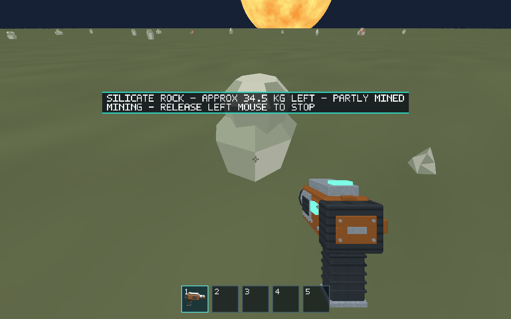
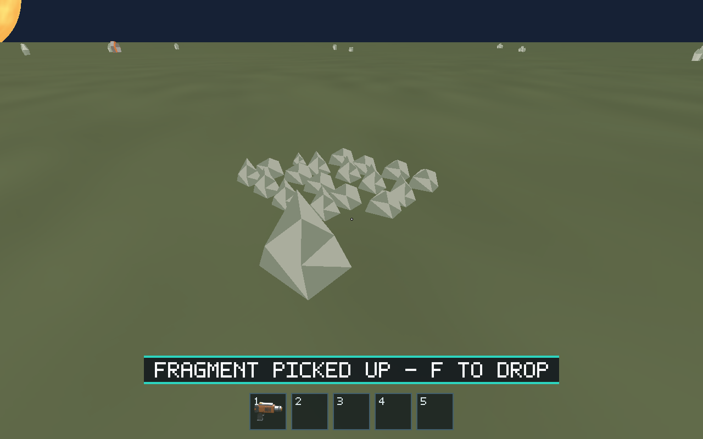

# Issue #149 — Left-mouse-only mining

Mining now starts and remains held only through left mouse. F exclusively
grabs/drops an eligible physical object; an initial press, hold, repeat or release
at a deposit cannot activate the tool or extract material. E retains its
cockpit/door route.

## Changes and coverage

- Removed keyboard mining state/fallback; retained the F grab/drop latch.
- Native and automation mouse input share gameplay/equipment/carrying gates.
  Native input additionally requires cursor capture.
- Updated prompts, current controls/contracts and all mining scenario actions.
  Automation uses `{"op":"mouse","button":"left","pressed":true}` (false to
  release). The ambiguous legacy `mine` keyboard alias is rejected.
- Added regression checks for F-only mass conservation, repeated F, simultaneous
  F/mouse, each release order, input reset, empty slots and explicit re-equip.
  Existing carrying routes verify pickup cancellation, carrying lockout, drop
  and unchanged E behavior. Native repeat/synthetic-event filters remain tested.
- Mining, carrying, transfer, streaming and resource-loop scenarios now mine
  with mouse input; baseline/evidence variants retain the same gameplay route.

## Validation

Ubuntu 24.04 x86_64, Python 3.12, Rust 1.95.0; Linux Mesa lavapipe Vulkan.
Checked-in assets were used without regeneration.

| Command | Result |
| --- | --- |
| `cargo +1.95.0 fmt --all -- --check` | Passed |
| `cargo +1.95.0 clippy --workspace --all-targets --locked -- -D warnings` | Passed |
| `cargo +1.95.0 test --workspace --locked` | 295 passed, 1 pre-existing ignored renderer test |
| `cargo +1.95.0 build --workspace --locked` | Passed |
| `python -m unittest discover -s scripts -p 'test_*.py'` | 35 passed |
| `python scripts/salimon-test suite --group resource-collection --binary /tmp/salimon-target/debug/salimon-client` | All 6 native baseline scenarios passed |
| `python scripts/salimon-test run scenarios/evidence/mining.json --binary /tmp/salimon-target/debug/salimon-client --artifacts /tmp/salimon-149-evidence --screenshot-command '["python", "scripts/capture_settled.py", "{path}"]'` | Passed; 154 steps |
| `python scripts/salimon-test run scenarios/evidence/carrying.json --binary /tmp/salimon-target/debug/salimon-client --artifacts artifacts/issue-149/carrying-evidence --screenshot-command '["python", "scripts/capture_settled.py", "{path}"]'` | Passed; 344 steps |
| `git diff --check` | Passed |

Rust test/build commands used these environment overrides to avoid empty
intermediate object files on the workspace filesystem:
`CARGO_BUILD_JOBS=2 CARGO_PROFILE_DEV_CODEGEN_UNITS=1 CARGO_PROFILE_TEST_CODEGEN_UNITS=1 CARGO_PROFILE_DEV_DEBUG=0 CARGO_PROFILE_TEST_DEBUG=0 CARGO_TARGET_DIR=/tmp/salimon-target`.
Initial ordinary compilation attempts with Rust 1.99/1.95 failed while archiving
dependency objects; the final commands above passed with these overrides.

Native commands used `WGPU_BACKEND=vulkan`,
`VK_DRIVER_FILES=/usr/share/vulkan/icd.d/lvp_icd.json` and a dedicated
1280×800 Xvfb display. Unix display sockets are unavailable here, so Xvfb was
started with `-nolisten unix -listen tcp -ac` and localhost DISPLAY.
Initial Unix-socket launches failed before renderer readiness. One initial
capture became empty on the workspace filesystem; mining evidence was rerun
under /tmp and final promoted images were verified.

## Evidence

[Native result summary](native-results.json) records scenario outcomes.
[Mining checkpoints](mining-checkpoints.json) records equipment, mining,
carrying and deposit inspections. These are native renderer/event-loop runs
using production command/controller routes and explicit fixed steps.

Held F at a valid equipped deposit leaves extracted mass at 0 and mining held false:

Left mouse activates extraction and the prompt advertises mouse release:

Equipped pickup stows the tool and clears toolbar selection:

## Limits

Direct xdotool F/mouse testing could not validate captured-cursor gameplay:
Xvfb reports `CursorGrabMode::Locked` unsupported, and native mouse mining is
correctly rejected without capture. Native key filters/shared routes and reset
logic are covered by Rust tests; rendered scenarios use the automation channel.
Real desktop focus/cursor transitions should also be checked on macOS/Windows.
This software-Vulkan debug run establishes behavior/presentation evidence,
not hardware performance. Release staging, Blender regeneration and unrelated
asset checks were not run for this input-only change.
