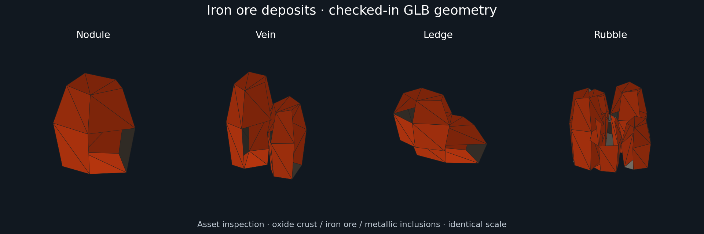
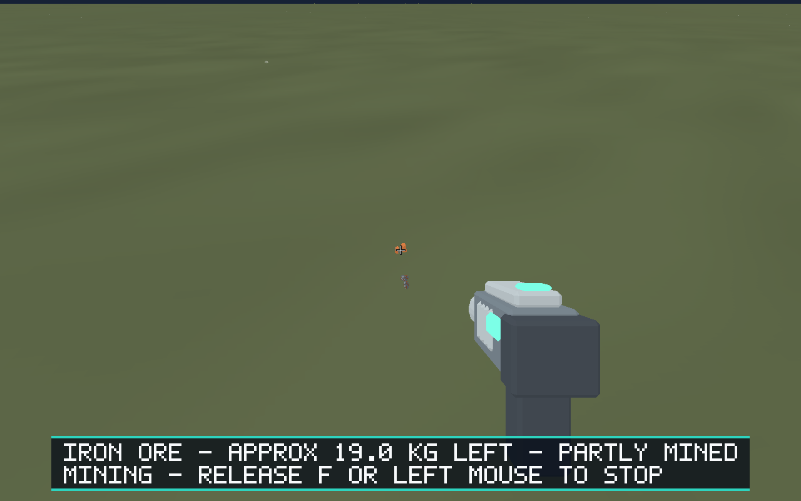

# Issue #86: Blender-authored iron ore deposits

Four editable Blender sources and generic validated GLB exports replace the last
procedural deposit cuboid: nodule, split vein, stepped ledge and rubble cluster.
Opaque oxide-orange crust, dark ore and metallic inclusions retain iron readability
and match the authored fragments. Geometry is original Salimon art without textures,
third-party content or additional add-ons.

Local deposit identity modulo four selects nodule/vein/ledge/rubble in that order.
Selection does not depend on mass, camera, query order or streaming. Depletion hides
the authored visual. Every baked vertex fits ±0.48 m; uniform scaling by
`bounds_radius_meters / (0.48 * sqrt(3))` inscribes the entire visual cube in the
existing authoritative spherical mining bound. The surface anchor and existing
axis-independent placement are preserved. No collider or targeting proxy is added.
World generation, identity, mining rate, mass, session persistence and streaming
controllers are unchanged. All assets join the existing single opaque resource draw.

The cuboid composition path is removed for deposits. Automation retains `visual`
as null for protocol compatibility and reports actual mesh/center/scale through
`authored_visual`. Runtime tests cover all four iron selections, rematerialization,
partial extraction, depletion, physical sizing and generated-deposit routing.
Renderer tests cover real exported geometry and subtract-before-narrowing precision.

The comparison reads actual GLB triangles/materials at identical scale. It is asset
inspection, not a native screenshot. Runtime uses flat colors and local facet fill;
it does not evaluate the Blender PBR metallic/roughness lighting.

The native walkthrough walks from the ship to iron deposit
`Earth:18012929353344056861` using production movement/look/equipment/mining inputs.
It extracts 3.2 kg in 100 fixed 16 ms steps (1.6 seconds), preserving the deposit ID
and `IronDepositVein` mesh. Small on-screen size follows the existing gameplay bound.
See [scenario](../../scenarios/evidence/iron-deposits.json),
[result](iron-mining-result.json) and [captured state](iron-mining-state.json).

## Validation

Environment: Linux x86_64, Python 3.12.14, Blender 4.5.3 LTS, Rust 1.99.0,
jsonschema 4.26.0; Xvfb 1280×800 and Mesa lavapipe software Vulkan.

- For each of `nodule vein ledge rubble`, ran
  `/tmp/blender-4.5.3-linux-x64/blender --background --python-exit-code 1 --python models/assets/resources/iron-deposit-<variant>/create_source.py`,
  then `python models/tools/export_asset.py resource.iron-deposit-<variant> --blender /tmp/blender-4.5.3-linux-x64/blender`:
  passed; generic validation runs before atomic export replacement.
- `python models/tools/validate_asset.py resource.iron-deposit-<variant>`:
  passed for all four. Saved sources re-exported to byte-identical GLBs.
- `BLENDER=/tmp/blender-4.5.3-linux-x64/blender python -m unittest discover -s models/tests -v`:
  passed, 48 tests including real Blender integration and iron geometry/material/bounds checks.
- `python -m unittest discover -s scripts -p 'test_*.py'`:
  passed, 34 tests.
- `cargo fmt --all -- --check`,
  `cargo clippy --workspace --all-targets --locked -- -D warnings`,
  `cargo test --workspace --locked`, `cargo build --workspace --locked`:
  passed. Workspace tests include the actual generated iron routing regression;
  the normal suite excludes the explicitly opt-in GPU test.
- `cargo test -p salimon-renderer --locked headless_resource_pipeline -- --ignored`:
  passed with lavapipe; resource GLB loading and GPU pipeline/shader validation succeed.
- `python scripts/build_game.py --profile release --output artifacts/build/release`:
  passed.
- `python scripts/salimon-test suite --group resource-collection --binary target/debug/salimon-client`:
  passed all six deposit/mining/carrying/transfer/streaming/resource-loop scenarios.
- `python scripts/salimon-test suite --group resource-collection --binary artifacts/build/release/salimon-client`:
  passed all six with the release executable and updated iron routing assertions.
- `python scripts/salimon-test run scenarios/evidence/resource-deposits.json --binary artifacts/build/release/salimon-client --screenshot-command '["python", "scripts/capture_settled.py", "{path}"]'`:
  passed including screenshot capture.
- The same command for `scenarios/evidence/iron-deposits.json`:
  passed all 79 steps including iron mining/mass/mesh assertions and screenshot capture.
- `git diff --check` and changed-document relative-link checks: passed.

Native commands used `DISPLAY=127.0.0.1:<Xvfb display>`,
`WGPU_BACKEND=vulkan`, `VK_DRIVER_FILES=/tmp/issue86-native/usr/share/vulkan/icd.d/lvp_icd.json`
and `LD_LIBRARY_PATH=/tmp/issue86-native/usr/lib/x86_64-linux-gnu`. Xvfb ran in the
same process environment using TCP because this workspace isolates networking
between shell sessions and restricts Unix socket binding. Initial cross-session
X connection failures were resolved with this configuration. Transient corrupt
Cargo archives/metadata were resolved by cleaning the affected cached package
and rerunning successfully; no dependency or lockfile changes were required.

| Variant | Triangles | GLB bytes | Materials/primitives | Texture bytes |
| --- | ---: | ---: | --- | ---: |
| Nodule | 26 | 4,248 | 3 / 3 | 0 |
| Vein | 52 | 5,612 | 3 / 3 | 0 |
| Ledge | 52 | 5,612 | 3 / 3 | 0 |
| Rubble | 130 | 9,696 | 3 / 3 | 0 |

## Limits

Existing axis-independent surface placement remains; radial orientation and authored
colliders are outside this change. Software Vulkan evidence does not establish
macOS Metal/Windows hardware fidelity or reference-machine performance. No packaged
OS-input smoke was run locally; gameplay actions were exercised through the native
automation protocol using production controllers. The issue awaits PR review/merge.
