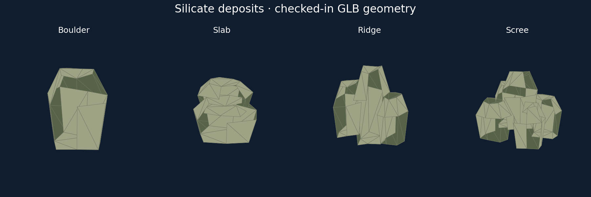

# Issue #87: authored silicate deposits

Four editable Blender sources and validated generic GLB exports replace the
silicate cuboid: boulder, layered slab, ridge and scree. Muted opaque olive/grey
materials match silicate fragments and differ from rusty iron and blue ice.
Local deposit ID modulo four selects the variant independently of streaming,
camera, remaining mass and query order. Depleted deposits emit no visual.

Runtime supplies the absolute world center and uniform scale
`bounds_radius_meters / (0.48 * sqrt(3))`. All baked vertices fit ±0.48 m, so
visuals stay inside the existing authoritative spherical bound. Generation,
mining, mass, in-memory persistence and streaming controllers are unchanged.
Renderer adds the exports to its existing opaque resource batch and preserves
subtract-before-narrowing precision. Automation exposes `authored_visual`
(mesh, center, scale); scenarios now assert mesh routing and depleted absence
while retaining existing identity, mass, mining and streaming assertions.

This comparison plots actual checked-in GLB triangles/materials. It is asset
inspection, not a native-game screenshot or hardware evidence.

## Validation

Environment: Linux x86_64, Python 3.12.14, Blender 4.5.3 LTS,
jsonschema 4.26.0; standalone rustfmt 1.99.0.

- For each of `boulder slab ridge scree`, ran
  `/tmp/blender-4.5.3-linux-x64/blender --background --python-exit-code 1 --python models/assets/resources/silicate-deposit-<variant>/create_source.py`,
  then `python models/tools/export_asset.py resource.silicate-deposit-<variant> --blender /tmp/blender-4.5.3-linux-x64/blender`:
  passed; generic validation executes before atomic export replacement.
- `python models/tools/validate_asset.py resource.silicate-deposit-<variant>`:
  passed for all four exports.
- `BLENDER=/tmp/blender-4.5.3-linux-x64/blender python -m unittest discover -s models/tests -v`:
  passed, 47 tests including real Blender integration and new deposit validation.
- `python -m unittest discover -s scripts -p 'test_*.py'`:
  passed, 34 tests (before scenario assertion updates; final rerun recorded below).
- Standalone rustfmt applied to changed Rust files; `git diff --check`: passed.
- Cargo/workspace and native graphical checks: pending PR CI; Cargo is not
  installed in the local environment. Results will be recorded after CI completes.

| Variant | Triangles | GLB bytes | Materials/primitives | Texture bytes |
| --- | ---: | ---: | --- | ---: |
| Boulder | 38 | 4,028 | 2 / 2 | 0 |
| Slab | 76 | 5,932 | 2 / 2 | 0 |
| Ridge | 114 | 7,848 | 2 / 2 | 0 |
| Scree | 190 | 11,664 | 2 / 2 | 0 |

Regression tests cover exported geometry uniqueness, opacity/materials, baked
transforms, spherical bounds, stable selection through rematerialization and
partial extraction, depletion, iron routing and large-origin precision.

## Limits

Existing axis-independent placement remains centered at the surface anchor;
no radial orientation or collider policy is introduced. Software Vulkan does
not establish macOS/Windows hardware fidelity or reference-machine performance.
The issue remains open until the linked PR is reviewed and merged.
