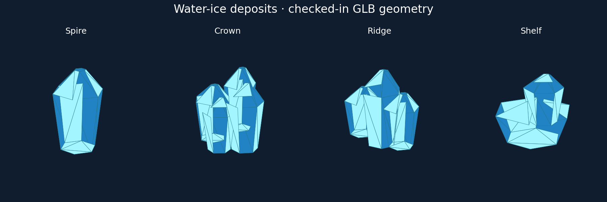

# Issue #88: authored water-ice deposits

Four editable Blender sources and checked-in generic GLB exports replace the
water-ice deposit cuboid: spire, crown, ridge and shelf. Each has two opaque
blue/frost materials, no textures or transparency and a 240-triangle/32-KiB
budget. Local deposit ID modulo four selects the variant; session mass changes,
streaming and camera movement do not affect selection. Depleted deposits emit
no visual. Iron/silicate deposit presentation is unchanged.

Runtime composition supplies absolute world centers and a uniform visual scale
of `bounds_radius_meters / (0.48 * sqrt(3))`. All baked vertices fit ±0.48 m, so
the entire visual stays inside the existing spherical gameplay bound on every
body/latitude. No generation, mining, mass, persistence, contact or streaming
code is changed. Renderer loads these assets into the existing opaque resource
batch and retains subtract-before-narrowing camera precision.

This comparison plots actual checked-in GLB triangles and material colors;
it is asset inspection, not a native-game screenshot or hardware evidence.

## Validation

Environment: Linux x86_64, Python 3.12.14, Blender 4.5.3 LTS (67807e1800cc),
jsonschema 4.26.0.

- For each of `spire crown ridge shelf`, ran
  `/tmp/blender-4.5.3-linux-x64/blender --background --python-exit-code 1 --python models/assets/resources/water-ice-deposit-<variant>/create_source.py`,
  then `python models/tools/export_asset.py resource.water-ice-deposit-<variant> --blender /tmp/blender-4.5.3-linux-x64/blender`:
  passed; generic semantic validation executes before atomic export replacement.
- `BLENDER=/tmp/blender-4.5.3-linux-x64/blender python -m unittest discover -s models/tests -v`:
  passed, 46 tests including real Blender round trips and all four deposit assets.
- `python -m unittest discover -s scripts -p 'test_*.py'`:
  passed, 34 tests.
- `git diff --check`: passed.
- Rust format/lint/workspace tests and staged native gameplay checks:
  delegated to the PR's existing three-platform Native builds workflow; results
  will be recorded once available. Rust was not installed locally. Automatic
  approval review rejected executing the downloaded Rust installer.

Regression coverage checks opaque materials, baked transforms, distinct exported
geometry, actual vertex bounds, the spherical scaling rule, stable identity
across rematerialization/partial extraction, depletion, non-ice routing and
large-origin precision. Existing world/mining/session tests and resource native
scenarios exercise unchanged gameplay through CI.

## Limits

The existing axis-independent deposit placement remains centered at the surface
anchor; there is no new radial orientation. CPU/asset checks alone do not prove
native presentation. Linux software Vulkan CI does not establish macOS/Windows
hardware fidelity or reference-machine performance. The issue stays open until
its linked PR is reviewed and merged.
