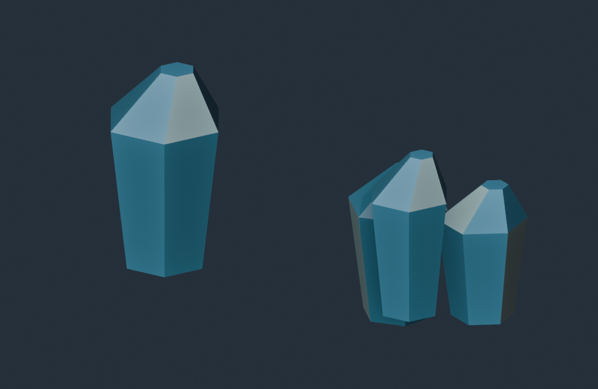

# Issue #91 — Blender-authored water-ice fragments

## Outcome

Two editable Blender 4.5.3 LTS sources and generic validated GLB exports replace
water-ice's three-cuboid presentation. Even fragment IDs choose a tapered shard;
odd IDs choose a three-shard cluster. Selection reads only stable identity.
The renderer loads exports once, batches both variants into one opaque draw,
and scales their ±0.48 m local geometry by the authoritative bounding-cube side.
Camera subtraction stays in `f64` before vertex narrowing. Colors use two
texture-free opaque materials and inexpensive static facet shading.

World mass/volume, mining output, carrying, dropping, in-memory persistence,
ship-local movement and custom fragment contacts are unchanged. Other resource
materials retain their existing procedural presentation. Normal builds embed
the checked-in GLBs and do not require Blender. The source recipes, manifests,
asset guides and affected architecture guides are included.

## Visual evidence



This is a Blender Workbench preview of the **re-imported runtime GLBs**, not a
native gameplay screenshot. The exports were inspected for silhouette, material
regions, scale and orientation. Runtime appearance uses the renderer's cheaper
flat-color facet shading rather than Blender studio lighting.

| Variant | Triangles | Primitives / materials | Textures | GLB bytes |
| --- | ---: | ---: | ---: | ---: |
| Shard | 32 | 2 / 2 | 0 | 3,716 |
| Cluster | 96 | 2 / 2 | 0 | 6,984 |

## Validation

Environment: Linux x86_64, Rust/Cargo 1.99.0, Blender 4.5.3 LTS,
Mesa lavapipe Vulkan. All commands ran from repository root.

Passed:

- `python models/tools/export_asset.py resource.water-ice-fragment-shard --blender /tmp/blender-4.5.3-linux-x64/blender`
- `python models/tools/export_asset.py resource.water-ice-fragment-cluster --blender /tmp/blender-4.5.3-linux-x64/blender`
- `python models/tools/validate_asset.py resource.water-ice-fragment-shard`
- `python models/tools/validate_asset.py resource.water-ice-fragment-cluster`
- `BLENDER=/tmp/blender-4.5.3-linux-x64/blender python -m unittest discover -s models/tests -v`: 43 tests, including actual Blender export integration and both checked-in ice exports.
- `python -m unittest discover -s scripts -p 'test_*.py'`: 34 tests.
- `cargo fmt --all -- --check`
- `cargo clippy --workspace --all-targets --locked -- -D warnings`
- `cargo test --workspace --locked`: 246 tests; explicit GPU test ignored by default.
- `cargo build --workspace --locked`
- `WGPU_BACKEND=vulkan VK_DRIVER_FILES=/usr/share/vulkan/icd.d/lvp_icd.json cargo test -p salimon-renderer headless_resource_pipeline --locked -- --ignored`: pipeline/shader validation on a real headless software GPU adapter.
- `git diff --check`

Regression tests cover distinct bounded exported geometry, scaling at multiple
sizes, subtraction at a 10¹² m origin, deterministic identity mapping across
position and mass changes, and absence of procedural water-ice cuboids. Existing
world/runtime tests retain mining, carrying, streaming and ship-transfer coverage.

Blocked graphical check:

```sh
WGPU_BACKEND=vulkan VK_DRIVER_FILES=/usr/share/vulkan/icd.d/lvp_icd.json xvfb-run -a -s '-screen 0 1280x800x24' python scripts/salimon-test suite --group resource-collection --evidence --binary target/debug/salimon-client --screenshot-command '["python", "scripts/capture_settled.py", "{path}"]'
```

All six routes failed before readiness because Xvfb could not establish display
sockets (`Cannot establish any listening sockets`; winit `Failed to open
connection to X server`). A TCP-listener alternative also could not start a
display. These are environment-blocked launches, not passing native evidence.
The headless GPU check validates pipeline construction, not rendered appearance
or gameplay. Native screenshots, packaged smoke and reference macOS hardware
performance were not established locally; GitHub Actions supplies the normal
native graphical gates. No macOS/Windows local checks were run.

The PR closes #91 on merge; the issue remains open for review.
