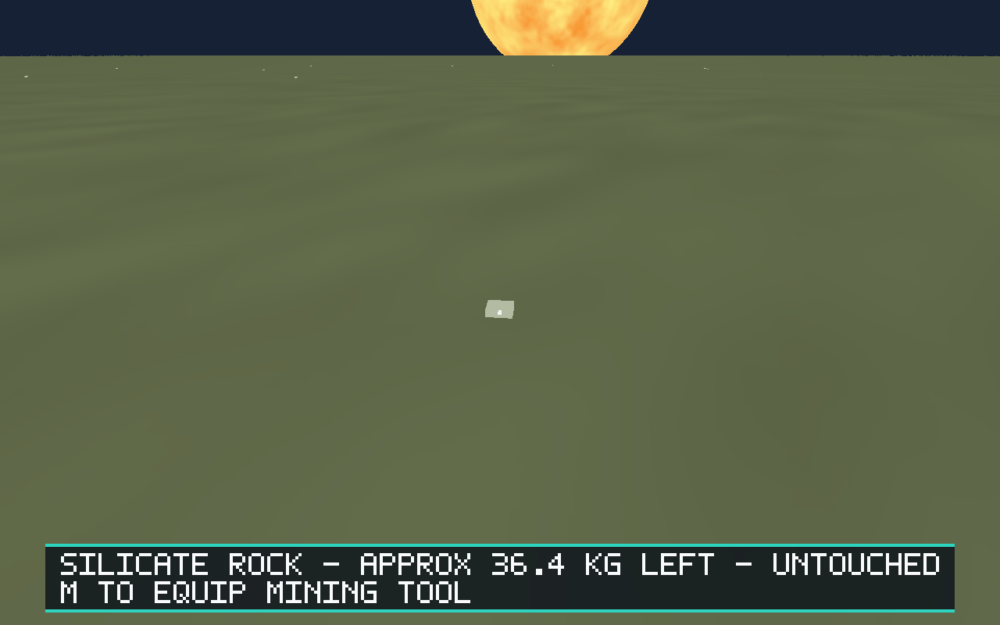
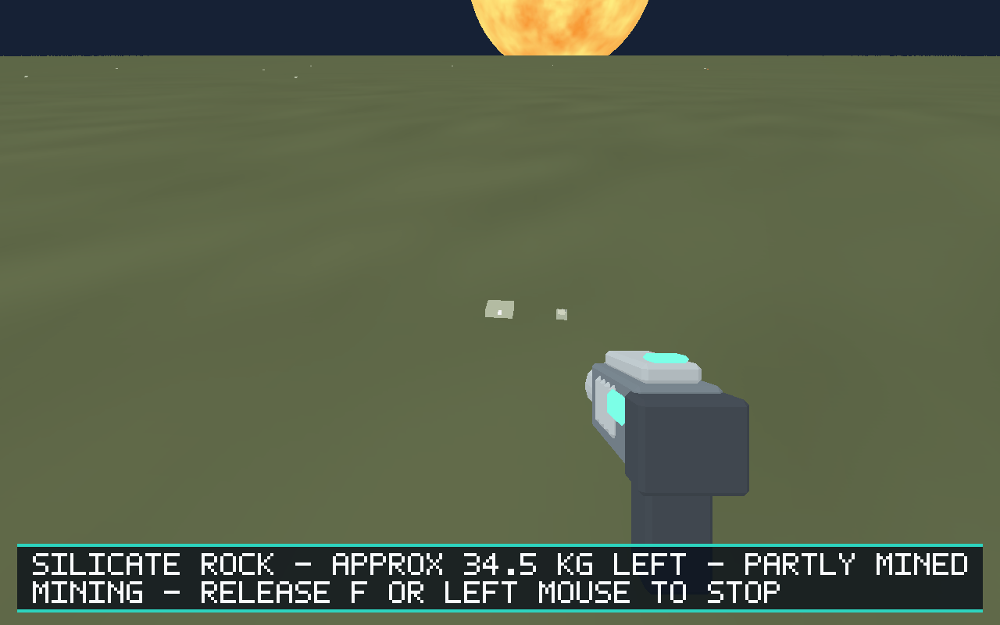
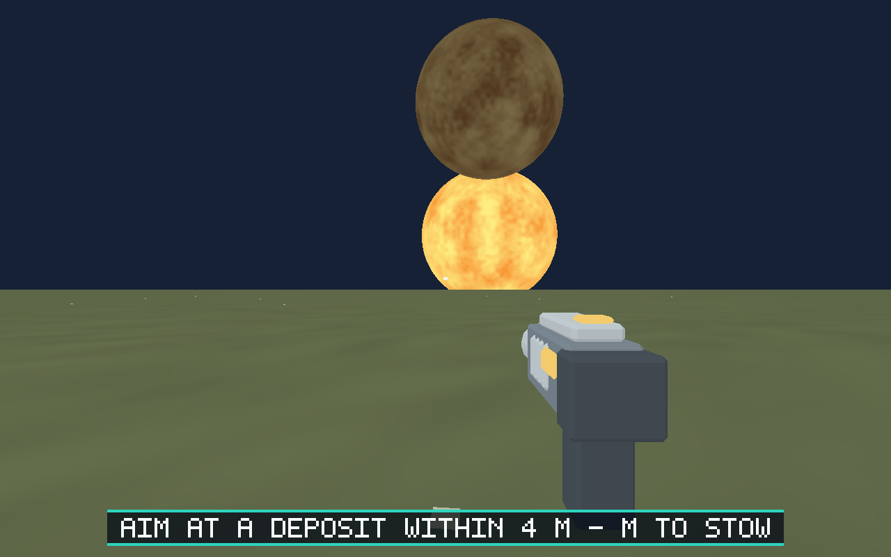
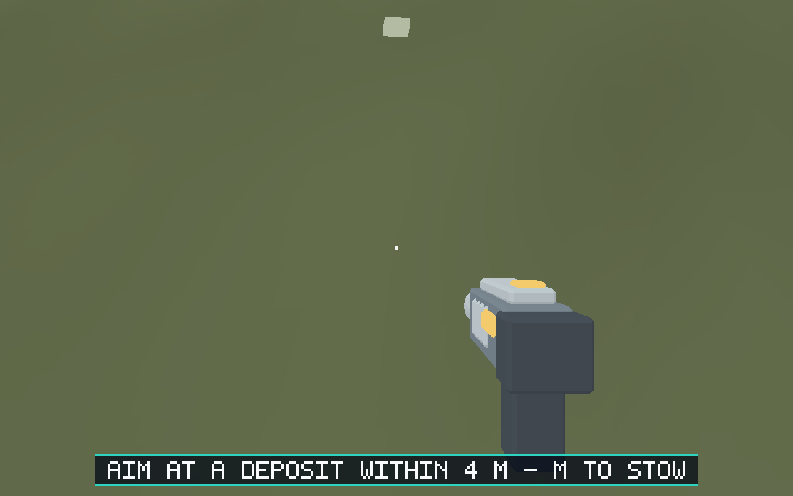

# Issue #92 — authored first-person mining tool

Validated on 2026-10-05, Ubuntu 24.04 x86_64, Rust 1.99.0, Blender 4.5.3 LTS,
Mesa lavapipe 25.2.8 and a dedicated Xvfb 1280×800 display.

## Outcome

Replaced the equipped tool's three procedural cuboids with an original editable
Blender item and a validated, embedded GLB. The model has a chamfered housing,
battery, grip, cooling fins, emitter and separate amber/teal status regions.
It uses the generic item export/validation pipeline: 640 triangles, 12
primitives, four opaque materials, no textures, 53,044 bytes, one runtime draw.

The renderer owns mesh loading and camera-local placement, with an identity
`SOCKET_Grip` contract. The grip remains 0.55 m forward, 0.20 m right and 0.20 m
down regardless of pitch, gravity or world origin. Ordinary scene reverse-Z
occlusion is retained. Runtime owns surface/gameplay/equip visibility and
passes existing active state. Mining ray, range, targeting, extraction rate,
controls and the separate aim marker remain unchanged.

[Authoring and grip contract](../../models/assets/items/mining-tool/README.md).

## Checks

All final checks below passed:

- `python models/tools/export_asset.py item.mining-tool --blender /tmp/blender-4.5.3-linux-x64/blender`
- `python models/tools/validate_asset.py item.mining-tool`
- `BLENDER=/tmp/blender-4.5.3-linux-x64/blender python -m unittest discover -s models/tests -v`
  — 40 tests, including real Blender integration and scout validation.
- `cargo fmt --all -- --check`
- `cargo clippy --workspace --all-targets --locked -- -D warnings`
- `cargo test --workspace --locked` — 238 tests, zero failures.
- `cargo build --workspace --locked` — normal build with checked-in exports.
- `python -m unittest discover -s scripts -p 'test_*.py'` — 34 tests.
- `python scripts/salimon-test run scenarios/evidence/mining-tool.json --binary target/debug/salimon-client --screenshot-command '["python", "scripts/capture_settled.py", "{path}"]'`
  — 146 steps, including stow/equip, camera pitch captures, activation, 1.92 kg
  extraction, partial mining and depletion. [Checkpoint state](mining-evidence.json).
- `python scripts/salimon-test suite --group resource-collection --binary target/debug/salimon-client`
  — all six scenarios passed: deposits, mining, carrying, fragment transfer,
  streaming and resource loop. [Suite results](resource-suite.json).

Native commands used `WGPU_BACKEND=vulkan`,
`VK_DRIVER_FILES=/usr/share/vulkan/icd.d/lvp_icd.json`, and `DISPLAY=127.0.0.1:94`.
Xvfb was launched in the same command context with
`Xvfb :94 -screen 0 1280x800x24 -nolisten unix -nolisten local -listen tcp -ac`.
The initial ordinary `xvfb-run` attempt could not open Unix listeners in this
execution environment; the working display completed both final runs.

## Visual evidence

Screenshots were captured from the final checked-in GLB in the native game and
visually inspected. The housing and grip silhouette stay fixed through pitch;
indicator regions are readable in both states, with the action bar overlay
retaining its current placement.

| Stowed | Equipped, idle | Active mining |
| --- | --- | --- |
|  |  |  |

| Looking up | Looking down |
| --- | --- |
|  |  |

## Limitations

Native visual validation uses software Vulkan and a debug build; macOS Metal,
Windows hardware, release packaging and reference-machine FPS were not tested.
This is a static lightweight model, with no animated hands or moving parts.
The custom renderer uses base colors, a stable inexpensive fill and runtime
status colors rather than a general PBR item-material system.
